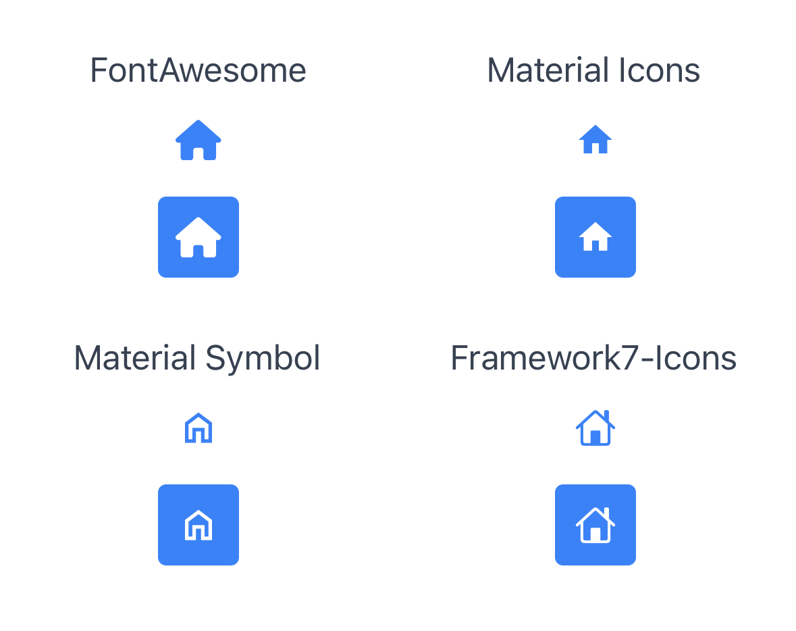
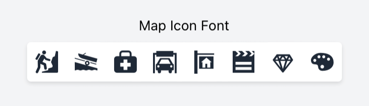

# Commands
The following is a description of the various commands that can be used with **PurgeTSS**:

- `init`: Initializes PurgeTSS on an existing Alloy project.
- `create`: Creates a new Alloy project with PurgeTSS already set up.
- `watch`: Runs purgetss automatically every time the project is compiled (`--on` by default).
- `build`: Generates the `tailwind.tss` file based on the configuration in `config.js`.
- `shades`: Generates shades and tints for a given color, and outputs the corresponding code in `config.js`.
- `color-module`: Creates a `./app/lib/purgetss.colors.js` file, which contains all of the colors defined in `config.js`.
- `module`: Installs the `purgetss.ui.js` module in the `lib` folder.
- `copy-fonts`: Copies the official icon fonts for PurgeTSS into the `./app/assets/fonts` folder.
- `build-fonts`: Generates a `./purgetss/styles/fonts.tss` file with class definitions and fontFamily selectors for custom fonts.
- `update`: Updates PurgeTSS to the latest version.
- `sudo-update`: Updates PurgeTSS to the latest version, using sudo to install **NPM** modules if necessary.


## `init` command
The `init` command sets up **PurgeTSS** by creating a `./purgetss/config.js` file at the root of an existing Alloy project.

No arguments or options are needed. The command will create the file for you inside the `./purgetss/` folder.

```bash
> purgetss init

# alias:
> purgetss i
```

```typescript title="./purgetss/config.js"
module.exports = {
  purge: {
    mode: 'all',
    method: 'sync', // How to execute auto-purging task: sync or async

    // These options are passed directly to PurgeTSS
    options: {
      legacy: false, // Generates & Purge tailwind.tss v5.x classes
      missing: true, // Report missing classes
      widgets: false, // Purge widgets too
      safelist: [], // Array of classes to keep
      plugins: [] // Array of properties to ignore
    }
  },
  theme: {
    extend: {}
  }
};
```

:::tip To learn more

**PurgeTSS** will look for this file `./purgetss/config.js`, where each section is optional and can be customized. Missing sections will use the default configuration.

To learn more and view some examples, see the **[Configuration Section](customization/the-config-file)**

:::

## `build` command
The `build` command generates the `tailwind.tss` file based on the configuration in `config.js`. This is useful if you've made changes to the `config.js` file and want to update the `tailwind.tss` file to reflect those changes.


```bash
> purgetss build

# alias:
> purgetss b
```

When `purgetss` runs, either manually or automatically (see `purgetss watch` below), it will check for any changes made to the `config.js` file and will regenerate `tailwind.tss` when necessary.


## `shades` command
It generates shades and tints for a given color and outputs the corresponding code in `config.js`.

This makes it easier to create a consistent color scheme for your app.


```bash
> purgetss shades [hexcode] [name]

# alias:
> purgetss s [hexcode] [name]
```

### Arguments
  - `[hexcode]` is the base hexcode value. *Omit it to create a random color*
  - `[name]` is the name of the color. *Omit it and a name based on the color's hue will be chosen*

### Options
  - `-n, --name` specifies the name of the color
  - `-q, --quotes` keeps double quotes in the `config.js` file
  - `-r, --random` generates shades from a random color
  - `-s, --single` generates a single color definition
  - `-t, --tailwind` logs the generated shades with a `tailwind.config.js` compatible structure
  - `-l, --log` logs the generated shades instead of saving them
  - `-j, --json` logs a JSON compatible structure, which can be used in `./app/config.json`, for example

:::info

More than 64% of all `tailwind.tss` classes are for color-related properties, so having a tool like `shades` to extend them with new colors is a great addition to **PurgeTSS**!

:::

Basic usage

```bash
> purgetss shades 53606b Primary

# alias:
> purgetss s 53606b Primary

::PurgeTSS:: "Primary" (#53606b) saved in config.js
```

The generated color shades will be added to your `config.js` file, which will automatically generate the `tailwind.tss` file with the new colors.

```js title="./purgetss/config.js"
module.exports = {
  // ...
  theme: {
    extend: {
      colors: {
        primary: {
          50: '#f4f6f7',
          100: '#e3e7ea',
          200: '#cad2d7',
          300: '#a6b3ba',
          400: '#7a8b96',
          500: '#5f707b',
          600: '#53606b',
          700: '#464f58',
          800: '#3e444c',
          900: '#373c42',
          default: '#53606b'
        }
      }
    }
  },
  // ...
}
```

Output to the console instead of saving

```bash
> purgetss shades 53606b Primary --log

# alias:
> purgetss s 53606b Primary -l

::PurgeTSS:: "Primary" (#53606b)
{
  colors: {
    primary: {
      50: '#f4f6f7',
      100: '#e3e7ea',
      200: '#cad2d7',
      300: '#a6b3ba',
      400: '#7a8b96',
      500: '#5f707b',
      600: '#53606b',
      700: '#464f58',
      800: '#3e444c',
      900: '#373c42',
      default: '#53606b'
    }
  }
}
```

Output to the console the generated shades with a `tailwind.config.js` compatible structure

```bash
> purgetss shades 000f3d --tailwind

# alias:
> purgetss s 000f3d -t

::PurgeTSS:: “Stratos” (#000f3d)
{
  colors: {
    stratos: {
      '50': '#e5f4ff',
      '100': '#cfecff',
      '200': '#a9d8ff',
      '300': '#75bbff',
      '400': '#3f8cff',
      '500': '#145dff',
      '600': '#0047ff',
      '700': '#0048ff',
      '800': '#0040e3',
      '900': '#000f3d'
    }
  }
}
```

Generate a random color value and log it to the console

```bash
> purgetss shades -rl

::PurgeTSS:: "Harlequin" (#44ed20)
{
  colors: {
    harlequin: {
      50: '#ecffe6',
      100: '#d5fec9',
      200: '#adfd99',
      300: '#7bf85e',
      400: '#44ed20',
      500: '#2ed40e',
      600: '#1daa06',
      700: '#19810a',
      800: '#18660e',
      900: '#175611',
      default: '#44ed20'
    }
  }
}
```

Use the `--json` option to log a `config.json` compatible structure to the console

```bash
> purgetss shades '#65e92c' -j

::PurgeTSS:: "Lima" (#65e92c)
{
  "global": {
    "colors": {
      "lima": "#65e92c",
      "lima-50": "#f0fee7",
      "lima-100": "#dcfdca",
      "lima-200": "#bbfb9b",
      "lima-300": "#90f561",
      "lima-400": "#65e92c",
      "lima-500": "#48d012",
      "lima-600": "#34a60a",
      "lima-700": "#297e0d",
      "lima-800": "#246410",
      "lima-900": "#215413"
    }
  }
}
```

:::info
This is the first command that writes to the `config.js` file. If you find any issues, please report them so we can fix them as soon as possible!
:::

## `color-module` command
The `color-module` command creates a file called `purgetss.colors.js` in the `lib` folder, which contains all of the colors defined in `config.js`.

This command will create a file named `purgetss.colors.js` in the `lib` folder, containing all the colors defined in the `config.js` file.

```bash
> purgetss color-module

# alias:
> purgetss cm
```

```js title="./lib/purgetss.colors.js"
module.exports = {
  harlequin: {
    '50': '#ecffe6',
    '100': '#d5fec9',
    '200': '#adfd99',
    '300': '#7bf85e',
    '400': '#44ed20',
    '500': '#2ed40e',
    '600': '#1daa06',
    '700': '#19810a',
    '800': '#18660e',
    '900': '#175611',
    default: '#44ed20'
  },
  primary: {
    '50': '#f4f6f7',
    '100': '#e3e7ea',
    '200': '#cad2d7',
    '300': '#a6b3ba',
    '400': '#7a8b96',
    '500': '#5f707b',
    '600': '#53606b',
    '700': '#464f58',
    '800': '#3e444c',
    '900': '#373c42',
    default: '#53606b'
  },
  lima: {
    '50': '#f0fee7',
    '100': '#dcfdca',
    '200': '#bbfb9b',
    '300': '#90f561',
    '400': '#65e92c',
    '500': '#48d012',
    '600': '#34a60a',
    '700': '#297e0d',
    '800': '#246410',
    '900': '#215413',
    default: '#65e92c'
  }
}
```

This can be useful if you want to use these colors in your app's code, as you can simply import the `purgetss.colors.js` file rather than hardcoding the colors in multiple places.


## `watch` command
The `watch` command runs PurgeTSS automatically every time the project is compiled. You won't have to manually run the `build` command every time you make a change; PurgeTSS will take care of it for you.


```bash
> purgetss watch

# alias:
> purgetss w
```

This is especially useful when used with `LiveView` because it will automatically purge your project whenever you make a change, such as when adding or deleting styles in views.

**This provides instant feedback on any changes you make, which can speed up your prototyping process.**

The command will install a task in the `alloy.jmk` file to enable this behavior:

```javascript
task('pre:compile', function(event, logger) {
  require('child_process').execSync('purgetss', logger.warn('::PurgeTSS:: Auto-Purging ' + event.dir.project));
});
```

:::info `watch` command

Note that this feature is only compatible with regular Alloy projects that are compiled using the `ti build` command. It has not been tested with other types of projects, such as those built with Webpack or Vue.

:::

**Use the `--off` option to turn it off.**
```bash
> purgetss watch --off

# alias:
> purgetss w -o
```

## `module` command
The `module` command installs the `purgetss.ui.js` module in the `lib` folder.

```bash
> purgetss module

# alias:
> purgetss m
```

**PurgeTSS module contains:**

- **Animation**: Provides methods for `playing` or `applying` basic animations and transformations to Alloy objects.

:::tip To learn more

**see the [Animation Module](animation-module/introduction) documentation**

:::

## `create` command
The `create` command creates a new Alloy project with PurgeTSS already set up.

If a project with the same name already exists, it will prompt you to confirm whether you want to overwrite it.

Alternatively, you can use the `--force` flag to immediately overwrite the existing project.

```bash
> purgetss create 'Name of the Project' [--vendor="fontawesome, materialicons, materialsymbols, framework7"]

# alias:
> purgetss c 'Name of the Project' [-v=fa,mi,ms,f7]
```

### Requirements
Please make sure that the `app.idprefix` and `app.idprefix` properties are configured in Titanium’s `config.json` file.

```bash
# A name in reverse domain name format.
app.idprefix               = "com.yourdomain"

# Path to use as the workspace directory for new projects.
app.workspace              = "/<full-path-to>/<workspace>/<folder>"
# ...
```

Use the `ti config` command to set up both the `app.idprefix` and `app.workspace` settings:

```bash
ti config app.idprefix 'com.yourdomain'
ti config app.workspace 'the-full-path/to-the-workspace-folder'
```

### Installing Tailwind CSS
You can also include the `--tailwind` option to install **Tailwind CSS** in your project and work with the [**Tailwind CSS Intellisense**](https://marketplace.visualstudio.com/items?itemName=bradlc.vscode-tailwindcss) extension in VS Code, which provides features such as autocomplete, syntax highlighting, and linting

```bash
> purgetss create 'Name of the Project' [--tailwind]

# alias:
> purgetss c 'Name of the Project' [-t]
```

### List of Commands used
When you run `purgetss create "Name of the Project" [--vendor=fa,mi,ms,f7]`, the following commands will be executed:

- `ti config app.idprefix && ti config app.workspace` - retrieves the related values.
- `ti create -t app -p all -n "Name of the Project" --no-prompt --id "the-prefix-id-and-the-name-of-the-project"` - creates an App project with the specified name and its id set automatically.
- `cd app.workspace/"Name of the Project"` - changes to the newly created folder.
- `alloy new` - converts it to an Alloy Project.
- `purgetss w` - autoruns purgetss every time you compile your project.
- `purgetss b` - builds new `./purgetss/styles/tailwind.tss` and `./purgetss/config.js` files.
- `[-v=fa,mi,ms,f7, --vendor=fa,mi,ms,f7]` - sets the `--vendor` argument to copy the selected fonts into your project, including the CommonJS module into `./app/lib/` folder.
- `-t, --tailwind` - when using this option, the following commands will be executed:
  - `npm init -y && npm i tailwindcss -D && npx tailwindcss init` - installs Tailwind CSS and its dependencies.
- `code .`, `subl .`, or `open .` - uses either `code`, `subl`, or `open` to open VS Code, Sublime Text, or the project’s folder.

## `copy-fonts` command
The `copy-fonts` command copies the free versions of the [**Font Awesome**](https://github.com/FortAwesome/Font-Awesome/tree/master/js-packages/%40fortawesome/fontawesome-free/webfonts), [**Material Icons**](https://fonts.google.com/icons?icon.set=Material+Icons), [**Material Symbols**](https://fonts.google.com/icons?icon.set=Material+Symbols), and/or [**Framework7 Icons**](https://framework7.io/icons/) fonts into the `./app/assets/fonts` folder.

**You won't have to manually download and copy them into the appropriate folder.**


```bash
> purgetss copy-fonts [--vendor=fa,mi,ms,f7] [--module] [-styles]

# alias:
> purgetss cf [-v=fa,mi,ms,f7] [-m] [-s]
```

```bash title="./app/assets/fonts/"
FontAwesome6Brands-Regular.ttf
FontAwesome6Free-Regular.ttf
FontAwesome6Free-Solid.ttf
Framework7-Icons.ttf
MaterialIcons-Regular.ttf
MaterialIconsOutlined-Regular.otf
MaterialIconsRound-Regular.otf
MaterialIconsSharp-Regular.otf
MaterialIconsTwoTone-Regular.otf
MaterialSymbolsOutlined-Regular.ttf
MaterialSymbolsRounded-Regular.ttf
MaterialSymbolsSharp-Regular.ttf
```

After copying the desired fonts, you can use them in buttons and labels. Just set the font family to `fa` and the desired icon to `fa-home`, for example.

### Available font classes
- [**fontawesome.tss**](https://github.com/macCesar/purgeTSS/blob/master/dist/fontawesome.tss)
- [**materialicons.tss**](https://github.com/macCesar/purgeTSS/blob/master/dist/materialicons.tss)
- [**materialsymbols.tss**](https://github.com/macCesar/purgeTSS/blob/master/dist/materialsymbols.tss)
- [**framework7icons.tss**](https://github.com/macCesar/purgeTSS/blob/master/dist/framework7icons.tss)

### Copying specific font vendors
To copy specific font vendors, use any of the following arguments:

```bash
> purgetss copy-fonts --vendor="fontawesome, materialicons, materialsymbols, framework7"

# alias:
> purgetss cf -v=fa,mi,ms,f7
```

Available names and aliases:
- fa, fontawesome = Font Awesome Icons
- mi, materialicons = Material Icons
- ms, materialsymbol = Material Symbols
- f7, framework7 = Framework7 Icons

### CommonJS Module
You can use the `--module` flag to copy the corresponding CommonJS module into the `./app/lib/` folder.

```bash
> purgetss copy-fonts --module
> purgetss copy-fonts --module --vendor="fontawesome, materialicons, materialsymbols, framework7"

# alias:
> purgetss cf -m
> purgetss cf -m -v=fa,mi,ms,f7
```

Each library contains a CommonJS module that exposes the Unicode strings for Font Awesome, Material Icons, Material Symbols, and Framework7-Icons fonts.

All prefixes are stripped from their class names and are camel-cased. For example:

- **Font Awesome**: `fa-flag` becomes `flag`
- **Material Icons**: `mi-flag` becomes `flag`
- **Material Symbols**: `ms-flag` becomes `flag`
- **Framework7 Icons** `f7-alarm_fill` becomes `alarmFill` or `f7-clock_fill` becomes `clockFill`.

### Font Awesome Pro
If you have a **[Font Awesome Pro Account](https://fontawesome.com/pro)**, you can generate a custom `./purgetss/styles/fontawesome.tss` file with all the extra classes that the Pro version has ***(except duotone icons, see note below)***.

After setting the **[@fortawesome scope](https://fontawesome.com/how-to-use/on-the-web/setup/using-package-managers#installing-pro)** with your token, you can install it in your project's root folder with `npm init` and `npm install --save-dev @fortawesome/fontawesome-pro` (current version 6.2.1).

To generate a new `purgetss/styles/fontawesome.tss` file, run `purgetss build`. It will also automatically copy the Pro fonts files into `./app/assets/fonts` if needed.

**Note: Titanium cannot use FontAwesome's duotone icons because they have two separate glyphs for each individual icon.**

### Font Awesome 6 Beta
You can generate a custom `fontawesome.tss` file from **[Font Awesome 6 Beta](https://fontawesome.com/download)**.

To do so, move the `css` and `webfonts` folders from `fontawesome-pro-6.0.0-beta3-web/`:

```bash
fontawesome-pro-6.0.0-beta3-web
└─ css
└─ webfonts
```

Into `./purgetss/fontawesome-beta`:

```bash
purgetss
└─ fontawesome-beta
   ├─ css
   └─ webfonts
```

Then, as with the Pro version, run `purgetss build` to generate your custom `fontawesome.tss` file and beta-test your new icons!

### Font Example File
To use this file, follow these steps:
- Copy the content of `index.xml` into a new Alloy project
- Install the official icon font files with `purgetss copy-fonts`
- **Run `purgetss` once to generate the necessary files**
- Compile your app as usual.
- **We recommend using `liveview` to speed up testing and development time**

```xml title="index.xml"
<Alloy>
  <Window>
    <View class="grid">
      <View class="grid-cols-2 mx-auto gap-y-2 vertical">
        <!-- FontAwesome -->
        <Label class="mt-2 text-gray-700" text="FontAwesome" />
        <Button class="w-10 h-10 my-1 text-xl text-blue-500 fa fa-home" />
        <Button class="w-10 h-10 my-1 text-xl text-white bg-blue-500 rounded fa fa-home" />
      </View>

      <View class="grid-cols-2 mx-auto gap-y-2 vertical">
        <!-- Material Icons -->
        <Label class="mt-2 text-gray-700" text="Material Icons" />
        <Button class="w-10 h-10 my-1 text-xl text-blue-500 mi mi-home" />
        <Button class="w-10 h-10 my-1 text-xl text-white bg-blue-500 rounded mi mi-home" />
      </View>

      <View class="grid-cols-2 mx-auto gap-y-2 vertical">
        <!-- Material Symbol -->
        <Label class="mt-2 text-gray-700" text="Material Symbol" />
        <Button class="w-10 h-10 my-1 text-xl text-blue-500 ms ms-home" />
        <Button class="w-10 h-10 my-1 text-xl text-white bg-blue-500 rounded ms ms-home" />
      </View>

      <View class="grid-cols-2 mx-auto gap-y-2 vertical">
        <!-- Framework7-Icons -->
        <Label class="mt-2 text-gray-700" text="Framework7-Icons" />
        <Button class="w-10 h-10 my-1 text-xl text-blue-500 f7 f7-house" />
        <Button class="w-10 h-10 my-1 text-xl text-white bg-blue-500 rounded f7 f7-house" />
      </View>
    </View>
  </Window>
</Alloy>
```

```scss title="app.tss"
// PurgeTSS v6.2.0
// Created by César Estrada
// https://github.com/macCesar/purgeTSS

// Ti Elements
'View': { width: Ti.UI.SIZE, height: Ti.UI.SIZE }
'Window': { backgroundColor: '#ffffff' }

// Main Styles
'.bg-blue-500': { backgroundColor: '#3b82f6' }
'.gap-y-2': { top: 8, bottom: 8 }
'.grid': { layout: 'horizontal', width: '100%' }
'.grid-cols-2': { width: '50%' }
'.h-10': { height: 40 }
'.mt-2': { top: 8 }
'.mx-auto': { right: null, left: null }
'.my-1': { top: 4, bottom: 4 }
'.rounded': { borderRadius: 4 }
'.text-blue-500': { color: '#3b82f6', textColor: '#3b82f6' }
'.text-gray-700': { color: '#374151', textColor: '#374151' }
'.text-white': { color: '#ffffff', textColor: '#ffffff' }
'.text-xl': { font: { fontSize: 20 } }
'.vertical': { layout: 'vertical' }
'.w-10': { width: 40 }

// Default Font Awesome
'.fa':{ font: { fontFamily: 'FontAwesome6Free-Solid' } }
'.fa-home': { text: '\uf015', title: '\uf015' }

// Material Icons
'.mi': { font: { fontFamily: 'MaterialIcons-Regular' } }
'.mi-home': { text: '\ue88a', title: '\ue88a' }

// Material Symbols
'.ms': { font: { fontFamily: 'MaterialSymbolsOutlined-Regular' } }
'.ms-home': { text: '\ue88a', title: '\ue88a' }

// Framework7
'.f7': { font: { fontFamily: 'Framework7-Icons' } }
'.f7-house': { text: 'house', title: 'house' }
```




## `build-fonts` command
The `build-fonts` command generates a `fonts.tss` file with class definitions and fontFamily selectors for any serif, sans-serif, cursive, fantasy, or monospace font families.

To use it, first place all of the `.ttf` or `.otf` files that you want to use in `./purgetss/fonts/`, and then run the command. You can also use the `--module` flag to generate a CommonJS module in `./app/lib/`.


```bash
> purgetss build-fonts

# alias:
> purgetss bf
```

1. This will create the `./purgetss/styles/fonts.tss` file with all class definitions and `fontFamily` selectors.
2. It will also copy the font files into the `./app/assets/fonts` folder.
3. If necessary, **PurgeTSS will rename the font files to their corresponding PostScript names**.

In this example, we are using the [**Bevan and Dancing Script**](https://fonts.google.com/share?selection.family=Bevan:ital@0;1%7CDancing%20Script:wght@400;500;600;700) fonts from Google Fonts.

```bash title="./purgetss/fonts/"
purgetss
└─ fonts
   ├─ Bevan-Italic.ttf
   ├─ Bevan-Regular.ttf
   ├─ DancingScript-Bold.ttf
   ├─ DancingScript-Medium.ttf
   ├─ DancingScript-Regular.ttf
   └─ DancingScript-SemiBold.ttf
```

```scss title="./purgetss/syles/fonts.tss"
// Fonts TSS file generated with PurgeTSS
// https://github.com/macCesar/purgeTSS

'.bevan-italic': { font: { fontFamily: 'Bevan-Italic' } }
'.bevan-regular': { font: { fontFamily: 'Bevan-Regular' } }
'.dancingscript-bold': { font: { fontFamily: 'DancingScript-Bold' } }
'.dancingscript-medium': { font: { fontFamily: 'DancingScript-Medium' } }
'.dancingscript-regular': { font: { fontFamily: 'DancingScript-Regular' } }
'.dancingscript-semibold': { font: { fontFamily: 'DancingScript-SemiBold' } }
```

**Now you can use any of those fonts in your project.**

### Organizing the fonts folder
For better organization, you can group each font family in subfolders. For example:

```bash title="./purgetss/fonts/"
purgetss
└─ fonts
   └─ bevan
      ├─ Bevan-Italic.ttf
      ├─ Bevan-Regular.ttf
   └─ dancing-script
      ├─ DancingScript-Bold.ttf
      ├─ DancingScript-Medium.ttf
      ├─ DancingScript-Regular.ttf
      └─ DancingScript-SemiBold.ttf
```

By organizing the fonts folder in this way, you will get the same `fonts.tss` file as in the previous example, but with a much more organized `fonts` folder.

### Icon Font Libraries
You can add **any icon font library** that has either a `.ttf` or `.otf` font file and a `.css` file with Unicode characters.

In this example, we are using the [**map-icons**](http://map-icons.com) and [**microns**](https://www.s-ings.com/projects/microns-icon-font/) icon font libraries.

```bash title="./purgetss/fonts/"
purgetss
└─ fonts
   └─ bevan
   └─ dancing-script
   └─ mapicons
      ├─ map-icons.css
      └─ map-icons.ttf
   └─ microns
      ├─ microns.css
      └─ microns.ttf
```

After running `purgetss build-fonts`, you will have all the Unicode characters in `fonts.tss`.

```scss title="./purgetss/syles/fonts.tss"
// Fonts TSS file generated with PurgeTSS
// https://github.com/macCesar/purgeTSS

'.map-icons': { font: { fontFamily: 'map-icons' } }
'.microns': { font: { fontFamily: 'microns' } }

// Unicode characters
// To use your Icon Fonts in Buttons AND Labels each class sets 'text' and 'title' properties
// map-icons.css
'.map-icon-abseiling': { text: '\ue800', title: '\ue800' }
'.map-icon-accounting': { text: '\ue801', title: '\ue801' }
'.map-icon-airport': { text: '\ue802', title: '\ue802' }
'.map-icon-amusement-park': { text: '\ue803', title: '\ue803' }
'.map-icon-aquarium': { text: '\ue804', title: '\ue804' }
// ...

// microns.css
'.mu-arrow-left': { text: '\ue700', title: '\ue700' }
'.mu-arrow-right': { text: '\ue701', title: '\ue701' }
'.mu-arrow-up': { text: '\ue702', title: '\ue702' }
'.mu-arrow-down': { text: '\ue703', title: '\ue703' }
'.mu-left': { text: '\ue704', title: '\ue704' }
// ...
```



### CommonJS module
You can use the `--module` flag to generate a CommonJS module called `purgetss-fonts.js` in `./app/lib/`.

To avoid conflicts with other icon libraries that you may be using, **PurgeTSS will keep each icon prefix**.

```bash
> purgetss build-fonts --module

# alias:
> purgetss bf -m
```

```typescript title="./app/lib/purgetss.fonts.js"
const icons = {
  // map-icons
  'mapIcon': {
    'abseiling': '\ue800',
    'accounting': '\ue801',
    'airport': '\ue802',
    'amusementPark': '\ue803',
    // ...
  },
  // microns
  'mu': {
    'arrowLeft': '\ue700',
    'arrowRight': '\ue701',
    'arrowUp': '\ue702',
    'arrowDown': '\ue703',
    // ...
  }
};
exports.icons = icons;
```

## `update` command
The `update` command allows you to upgrade **PurgeTSS** to the most recent version. Use it to get the latest features and bug fixes that have been released.

```bash
> purgetss update

# alias:
> purgetss u
```

We constantly update **PurgeTSS** to add new features, include the latest versions of Tailwind, FontAwesome, etc., and fix bugs.

## `sudo-update` command
The `sudo-update` command is similar to the update command, but it's intended to be used when `sudo` is required to install **NPM** modules.

```bash
> purgetss sudo-update

# alias:
> purgetss su
```
