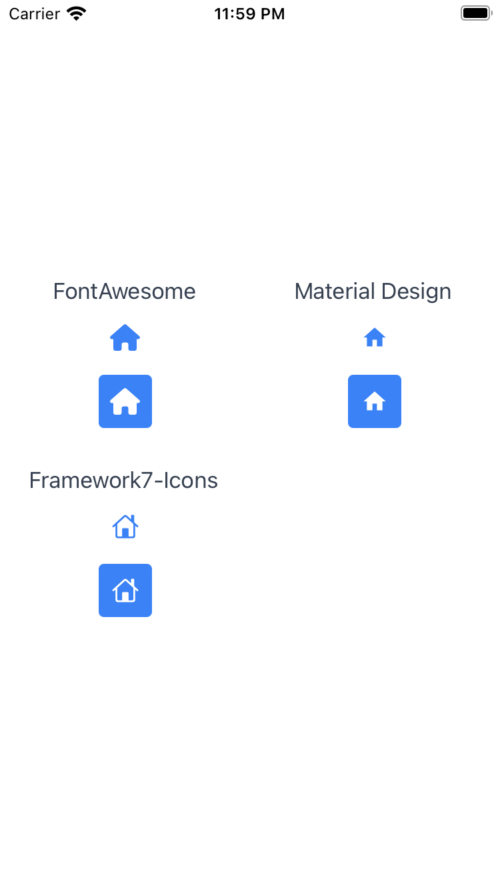

# Commands

## `init` command
Creates a `./purgetss/config.js` file at the root of your project.

```bash
> purgetss init

# alias:
> purgetss i
```

```typescript title="./purgetss/config.js"
module.exports = {
  purge: {
    mode: 'all',

    // These options are passed through directly to PurgeTSS
    options: {
      widgets: false, // Purge widgets
      missing: false, // Report missing classes
      safelist: [] // Array of classes to keep
    }
  },
  theme: {
    extend: {}
  },
  corePlugins: {}
};
```

`purgetss` will look for this file `./purgetss/config.js` file where you can define any customization.

Every section of the config file is optional, so you only have to specify whatever you'd like to customize. Any missing sections will fall back to the default configuration.

:::tip To learn more

To learn more and view some examples see **[Customization Section](customization/the-config-file)**

:::

## `build` command
When customizing your `config.js` file, you can re-generate `./purgetss/tailwind.tss` file by running:

```bash
> purgetss build

# alias:
> purgetss b
```

When `purgetss` runs, either manually or automatically (see `purgetss watch` below), it will check for any changes made to `config.js` file and will re-generate `tailwind.tss` when necessary.

:::info
After generating your new or updated `tailwind.tss` file, **PurgeTSS** will use it to parse your `xml` files.
:::

## `watch` command
Use this command to autorun `purgetss` every time you compile your project.

```bash
> purgetss watch

# alias:
> purgetss w
```

This is very useful in combination with `LiveView` because it will purge all of your files every time you make a change, for example when adding or deleting styles in your Views.

**You'll get instant feedback of any change you made and speed up your prototyping process significantly.**

:::info `watch` command
This only works with regular Alloy projects compiled with `[appc] ti build` command, we haven't test it with any other type of project like webpack or vue.
:::

**Use the `--off` option to turn it off.**
```bash
> purgetss watch --off

# alias:
> purgetss w -o
```

## `module` command
Use **`purgetss module`** command to install the `purgetss.ui.js` module in your `lib` folder.

```bash
> purgetss module

# alias:
> purgetss m
```

**PurgeTSS module contains:**

- **Animation**: Apply a 2D Matrix animation or transformation to any element or to an array of elements.

:::tip To learn more

**Please check out the [Animation Module](animation-module/introduction)**

:::

## `create` command
If you want to create a new Alloy Project with `purgetss` ready to go, use the `create` command.

```bash
> purgetss create 'Name of the Project' [--vendor="fontawesome, materialdesign, lineicons, boxicons, framework7, tablericons, bootstrapicons"]

# alias:
> purgetss c 'Name of the Project' [-v=fa,md,f7]
```

### Requirments
Please make sure you have `app.idprefix` and `app.idprefix` settings configured.

```bash
# A name in reverse domain name format.
app.idprefix               = "com.yourdomain"

# Path to use as the workspace directory for new projects.
app.workspace              = "/<full-path-to>/<workspace>/<folder>"
# ...
```

Use `ti config` to setup both `app.idprefix` and `app.workspace` settings:

```bash
ti config app.idprefix 'com.yourdomain'
ti config app.workspace 'the-full-path/to-the-workspace-folder'
```

### Installing Tailwind CSS
You can also include the `--tailwind` option to install `Tailwind CSS` in your project to work with [**Tailwind CSS Intellisense**](https://marketplace.visualstudio.com/items?itemName=bradlc.vscode-tailwindcss) extenstion in VS Code with features such as autocomplete, syntax highlighting, and linting.

```bash
> purgetss create 'Name of the Project' [--tailwind]

# alias:
> purgetss c 'Name of the Project' [-t]
```

### List of Commands used
When you run `purgetss create 'Name of the Project'` it will execute the following commands:

- **`ti config app.idprefix && ti config app.workspace`** To retreive the related values.
- **`ti create -t app -p all -n "Name of the Project" --no-prompt --id 'the-prefix-id-and-the-name-of-the-project'`** To create an App project with the specified name and its id set automatically.
- **`cd app.workspace/"Name of the Project"`** Change to the newly created folder.
- **`alloy new`** To convert it to an Alloy Project.
- **`purgetss w`** To autorun `purgetss` every time you compile your project.
- **`purgetss b`** To build a new `./purgetss/tailwind.tss` and `./purgetss/config.js` files.
- **`[-v=fa,md,f7]`** Set the `--vendor` argument to copy the selected fonts into your project. Including the CommonJS module into `./app/lib/` folder.
- **`--tailwind`** When using this option, it will execute the following commands
  - **`npm init -y && npm i tailwindcss -D && npm i postcss -D && npx tailwindcss init`** to install `Tailwind CSS` and its dependancies.
- **`code .`**, **`subl .`** or **`open .`** It will use either one of these commands to open `VS Code`, `Sublime Text` or the project’s folder in that order.

## `fonts` command
Use this command to copy the free versions of [**Font Awesome**](https://github.com/FortAwesome/Font-Awesome/tree/master/js-packages/%40fortawesome/fontawesome-free/webfonts), [**Material Design Icons**](https://github.com/google/material-design-icons) and [**Framework7 Icons**](https://framework7.io/icons/),  Fonts into your `app/assets/fonts` folder.

```bash
> purgetss fonts

# alias:
> purgetss f
```

```bash title="./app/assets/fonts/"
FontAwesome6Brands-Regular.ttf
FontAwesome6Free-Regular.ttf
FontAwesome6Free-Solid.ttf
MaterialIcons-Regular.ttf
MaterialIconsOutlined-Regular.otf
MaterialIconsRound-Regular.otf
MaterialIconsSharp-Regular.otf
MaterialIconsTwoTone-Regular.otf
Framework7-Icons.ttf
```

After copying the desired fonts, you can use them in Buttons and Labels, just set the Font Family like `fa` and the desired icon like `fa-home`.

### Available font classes
- [**fontawesome.tss**](https://github.com/macCesar/purgeTSS/blob/master/dist/fontawesome.tss)
- [**framework7icons.tss**](https://github.com/macCesar/purgeTSS/blob/master/dist/framework7icons.tss)
- [**materialdesignicons.tss**](https://github.com/macCesar/purgeTSS/blob/master/dist/materialdesignicons.tss)

### Copying specific font vendors
Use any of the following arguments to copy specific vendors:

```bash
> purgetss fonts --vendor="fontawesome, materialdesign, framework7"

# alias:
> purgetss f -v=fa,md,f7
```

Available names and aliases:
- fa, fontawesome = Font Awesome Icons
- md, materialdesign = Material Design Icons
- f7, framework7 = Framework7 Icons

### CommonJS Modules
You can use the `--modules` flag to copy the corresponding CommonJS modules into `./app/lib/` folder.

```bash
> purgetss fonts --modules
> purgetss fonts --modules --vendor="fontawesome, materialdesign, framework7"

# alias:
> purgetss f -m
> purgetss f -m -v=fa,md,f7
```

Each library contains a CommonJS module exposing the UniCode strings for Font Awesome Icons, Material Design Icons and Framework7-Icons fonts.

All prefixes are stripped out from their class names and are camelCased, for example:

- **Font Awesome**: `fa-flag` becomes `flag`
- **Material Design Icons**: `md-flag` becomes `flag`
- **Framework7 Icons** `f7-alarm_fill` becomes `alarmFill` or `f7-clock_fill` becomes `clockFill`.

### Font Awesome Pro
If you have a **[Font Awesome Pro Account](https://fontawesome.com/pro)** you can generate a custom `./purgetss/fontawesome.tss` file with all the extra classes that the Pro version has. ***(except duotone icons, see note below)***

After setting the **[@fortawesome scope](https://fontawesome.com/how-to-use/on-the-web/setup/using-package-managers#installing-pro)** with your token, you can install them in your project's root folder with `npm init` and `npm install --save-dev @fortawesome/fontawesome-pro` (current version 6.1.1)

Now, all you have to do is run `purgetss build` and it will generate a new `purgetss/fontawesome.tss` file and if needed, it will automatically copy the Pro fonts files into `app/assets/fonts`.

**Note: Titanium can't use FontAwesome's Duotone icons because they have two separate glyphs for each individual icon.**

### Font Awesome 6 Beta
You can generate a custom `fontawesome.tss` file from **[Font Awesome 6 Beta](https://fontawesome.com/download)**.

Just move `css` and `webfonts` folders from `fontawesome-pro-6.0.0-beta3-web/`:

```bash
fontawesome-pro-6.0.0-beta3-web
└─ css
└─ webfonts
```

Into `./purgetss/fontawesome-beta`:

```bash
purgetss
└─ fontawesome-beta
   ├─ css
   └─ webfonts
```

And as with the Pro Version, just run `purgetss build` to generate your custom `fontawesome.tss` file to beta-test your new icons!

### Font Example File
- Copy the content of `index.xml` into a new Alloy project
- Install the official icon font files with `purgetss fonts`
- **Run `purgetss` once to generate de necesary files**.
- Compile your app as usual.
- **We recommend that you use `liveview` to speed up testing and development time**.

```xml title="index.xml"
<Alloy>
  <Window>
    <View class="grid">
      <View class="grid-cols-2 mx-auto gap-y-2 vertical">
        <!-- FontAwesome -->
        <Label class="mt-2 text-gray-700" text="FontAwesome" />
        <Button class="w-10 h-10 my-1 text-xl text-blue-500 fa fa-home" />
        <Button class="w-10 h-10 my-1 text-xl text-white bg-blue-500 rounded fa fa-home" />
      </View>

      <View class="grid-cols-2 mx-auto gap-y-2 vertical">
        <!-- Material Design -->
        <Label class="mt-2 text-gray-700" text="Material Design" />
        <Button class="w-10 h-10 my-1 text-xl text-blue-500 md md-home" />
        <Button class="w-10 h-10 my-1 text-xl text-white bg-blue-500 rounded md md-home" />
      </View>

      <View class="grid-cols-2 mx-auto gap-y-2 vertical">
        <!-- Framework7-Icons -->
        <Label class="mt-2 text-gray-700" text="Framework7-Icons" />
        <Button class="w-10 h-10 my-1 text-xl text-blue-500 f7 f7-house" />
        <Button class="w-10 h-10 my-1 text-xl text-white bg-blue-500 rounded f7 f7-house" />
      </View>
    </View>
  </Window>
</Alloy>
```

```scss title="app.tss"
// PurgeTSS
// Created by César Estrada
// https://github.com/macCesar/purgeTSS

// Main styles
'Window': { backgroundColor: '#ffffff' }
'ImageView[platform=ios]': { hires: true }
'View': { width: Ti.UI.SIZE, height: Ti.UI.SIZE }
'.h-10': { height: 40 }
'.w-10': { width: 40 }
'.my-1': { top: 4, bottom: 4 }
'.mx-auto': { right: null, left: null }
'.mt-2': { top: 8 }
'.grid': { layout: 'horizontal' }
'.grid-cols-2': { width: '50%' }
'.vertical': { layout: 'vertical' }
'.rounded': { borderRadius: 4 }
'.text-xl': { font: { fontSize: 20 } }
'.gap-y-2': { top: 8, bottom: 8 }
'.bg-blue-500': { backgroundColor: '#3b82f6' }
'.text-white': { color: '#ffffff', textColor: '#ffffff' }
'.text-gray-700': { color: '#374151', textColor: '#374151' }
'.text-blue-500': { color: '#3b82f6', textColor: '#3b82f6' }

// Default Font Awesome styles
'.fa':{ font: { fontFamily: 'FontAwesome6Free-Solid' } }
'.fa-home': { text: '\uf015', title: '\uf015' }

// Material Design Icons styles
'.md': { font: { fontFamily: 'MaterialIcons-Regular' } }
'.md-home': { text: '\ue88a', title: '\ue88a' }

// Framework7 styles
'.f7': { font: { fontFamily: 'Framework7-Icons' } }
'.f7-house': { text: 'house', title: 'house' }
```




## `build-fonts` command
With the `build-fonts` command, you can create a `fonts.tss` file with all the class definitions and `fontFamily` selectors from any Serif, Sans-Serif, Cursive, Fantasy or Monospace font families.

**Just put all the `.ttf` or `.otf` files that you want to use in `./purgetss/fonts/`, and run the command**

```bash
> purgetss build-fonts

# alias:
> purgetss bf
```

1. It will create the `./purgetss/fonts.tss` file with all class definitions and `fontFamily` selectors
2. It will copy the font files into `./app/assets/fonts` folder
3. If necessary, **PurgeTSS will rename the font files to their corresponding PostScript Name**

In this example we are using the [**Bevan and Dancing Script**](https://fonts.google.com/share?selection.family=Bevan:ital@0;1%7CDancing%20Script:wght@400;500;600;700) fonts from Google Fonts.

```bash title="./purgetss/fonts/"
purgetss
└─ fonts
   ├─ Bevan-Italic.ttf
   ├─ Bevan-Regular.ttf
   ├─ DancingScript-Bold.ttf
   ├─ DancingScript-Medium.ttf
   ├─ DancingScript-Regular.ttf
   └─ DancingScript-SemiBold.ttf
```

```scss title="./purgetss/fonts.tss"
// Fonts TSS file generated with PurgeTSS
// https://github.com/macCesar/purgeTSS

'.bevan-italic': { font: { fontFamily: 'Bevan-Italic' } }
'.bevan-regular': { font: { fontFamily: 'Bevan-Regular' } }
'.dancingscript-bold': { font: { fontFamily: 'DancingScript-Bold' } }
'.dancingscript-medium': { font: { fontFamily: 'DancingScript-Medium' } }
'.dancingscript-regular': { font: { fontFamily: 'DancingScript-Regular' } }
'.dancingscript-semibold': { font: { fontFamily: 'DancingScript-SemiBold' } }
```

**Now you can use any of those fonts in your project.**

### Organizing the fonts folder
For better organization, you can group each font family in sub-folders, for example:

```bash title="./purgetss/fonts/"
purgetss
└─ fonts
   └─ bevan
      ├─ Bevan-Italic.ttf
      ├─ Bevan-Regular.ttf
   └─ dancing-script
      ├─ DancingScript-Bold.ttf
      ├─ DancingScript-Medium.ttf
      ├─ DancingScript-Regular.ttf
      └─ DancingScript-SemiBold.ttf
```

You will get the same `fonts.tss` file as the previous example, but with a much better organized fonts folder.

### Icon Font Libraries
You can add **any icon font library** that has either a `.ttf` or `.otf` font file and a `.css` file with unicode characters.

In this example we are using [**map-icons**](http://map-icons.com) and [**microns**](https://www.s-ings.com/projects/microns-icon-font/) icon font libraries.

```bash title="./purgetss/fonts/"
purgetss
└─ fonts
   └─ bevan
   └─ dancing-script
   └─ mapicons
      ├─ map-icons.css
      └─ map-icons.ttf
   └─ microns
      ├─ microns.css
      └─ microns.ttf
```

After running `purgetss build-fonts` you will have all the unicode characters in `fonts.tss`.

```scss title="./purgetss/fonts.tss"
// Fonts TSS file generated with PurgeTSS
// https://github.com/macCesar/purgeTSS

'.map-icons': { font: { fontFamily: 'map-icons' } }
'.microns': { font: { fontFamily: 'microns' } }

// Unicode characters
// To use your Icon Fonts in Buttons AND Labels each class sets 'text' and 'title' properties
// map-icons.css
'.map-icon-abseiling': { text: '\ue800', title: '\ue800' }
'.map-icon-accounting': { text: '\ue801', title: '\ue801' }
'.map-icon-airport': { text: '\ue802', title: '\ue802' }
'.map-icon-amusement-park': { text: '\ue803', title: '\ue803' }
'.map-icon-aquarium': { text: '\ue804', title: '\ue804' }
// ...

// microns.css
'.mu-arrow-left': { text: '\ue700', title: '\ue700' }
'.mu-arrow-right': { text: '\ue701', title: '\ue701' }
'.mu-arrow-up': { text: '\ue702', title: '\ue702' }
'.mu-arrow-down': { text: '\ue703', title: '\ue703' }
'.mu-left': { text: '\ue704', title: '\ue704' }
// ...
```


### CommonJS module
You can use the `--modules` flag to generate a CommonJS module called `purgetss-fonts.js` in `./app/lib/`.

To avoid any conflicts with other icon libraries that you may use, **PurgeTSS will keep each icon prefix**.

```bash
> purgetss build-fonts --modules

# alias:
> purgetss bf -m
```

```typescript title="./app/lib/purgetss.fonts.js"
const icons = {
  // map-icons
  'mapIcon': {
    'abseiling': '\ue800',
    'accounting': '\ue801',
    'airport': '\ue802',
    'amusementPark': '\ue803',
    // ...
  },
  // microns
  'mu': {
    'arrowLeft': '\ue700',
    'arrowRight': '\ue701',
    'arrowUp': '\ue702',
    'arrowDown': '\ue703',
    // ...
  }
};
exports.icons = icons;
```

## `update` command
Use this command to update **PurgeTSS** to the latest version.

```bash
> purgetss update

# alias:
> purgetss u
```

We constantly update **PurgeTSS** to add new features, to include the latest versions of Tailwind, FontAwesome, etc, and for bug fixes.

## `sudo-update` command
If you need to use `sudo` to install NPM modules, please use `purgetss sudo-update`

```bash
> purgetss sudo-update

# alias:
> purgetss su
```
