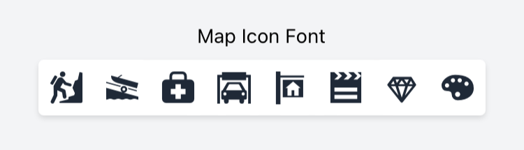

# Commands

:::info Changelog

For the latest changes and release notes, see the [CHANGELOG](https://github.com/macCesar/purgetss/blob/main/CHANGELOG.md).

:::

This page lists the commands available in PurgeTSS.

## Setup commands
- `init`: Initializes PurgeTSS on an existing Alloy project.
- `create`: Creates a new Alloy project with PurgeTSS already set up.
- `brand`: Generates the Titanium branding set from one main logo: launcher icons, adaptive icons, iOS 18+ Dark/Tinted variants, marketplace artwork, and optional Android splash assets. Android-specific logo overrides are available when needed.
- `images`: Generates multi-density UI images (Android `res-*` densities, iPhone `@1x`/`@2x`/`@3x` scales) from sources in `./purgetss/images/`. Works on both Alloy and Classic projects.

## Development commands
- `build`: Generates `utilities.tss` from `config.cjs`.
- `watch`: Runs `purgetss` automatically on each project compile (defaults to `--on`).

## Asset commands
- `icon-library`: Copies the official icon fonts into `./app/assets/fonts`.
- `build-fonts`: Generates `./purgetss/styles/fonts.tss` with class definitions and `fontFamily` selectors for custom fonts.

## Utility commands
- `shades`: Generates shades and tints for a color and writes the palette to `config.cjs`.
- `semantic`: Generates Titanium semantic colors (Light/Dark mode) into `app/assets/semantic.colors.json`. It supports tonal palettes (one base hex -> 11 shades with mirror inversion) and single purpose-based colors (explicit light + dark + optional alpha).
- `color-module`: Creates `./app/lib/purgetss.colors.js` with the colors defined in `config.cjs`.
- `module`: Installs `purgetss.ui.js` in the `lib` folder.

## Maintenance commands
- `update`: Updates PurgeTSS to the latest version.
- `sudo-update`: Updates PurgeTSS using `sudo` to install npm modules if needed.


## `init` command

The `init` command sets up PurgeTSS by creating `./purgetss/config.cjs` at the root of an existing Alloy project.

No arguments or options are needed. The command creates the file inside `./purgetss/`.

```bash
> purgetss init

# alias:
> purgetss i
```

```javascript title="./purgetss/config.cjs"
module.exports = {
  purge: {
    mode: 'all',
    method: 'sync', // How to execute the auto-purging task: sync or async

    // These options are passed directly to PurgeTSS
    options: {
      missing: true, // Reports missing classes
      widgets: false, // Purges widgets too
      safelist: [], // Array of classes to keep
      plugins: [] // Array of properties to ignore
    }
  },
  brand: {
    logos: {},  // empty = auto-discovers from purgetss/brand/
    padding: {
      ios: '4%',
      androidLegacy: '10%',
      androidAdaptive: '19%',
      featureGraphic: '12%'
    },
    android: {
      splash: false,
      notification: false
    },
    ios: {
      dark: true,
      tinted: true,
      darkBackground: null  // null = transparent per Apple HIG
    },
    colors: {
      background: '#FFFFFF'
    },
    confirmOverwrites: true  // prompt before overwriting files (set false to skip)
  },
  images: {
    quality: 85,             // JPEG/WebP/AVIF quality (0-100)
    format: null,            // null = keep original; 'webp' | 'jpeg' | 'png' to convert every image
    confirmOverwrites: true  // prompt before overwriting files (set false to skip)
  },
  theme: {
    extend: {}
  }
};
```

`init` also creates empty `purgetss/fonts/`, `purgetss/brand/`, and `purgetss/images/` folders so you can see where each kind of asset goes.

:::tip To learn more

PurgeTSS looks for `./purgetss/config.cjs`. Each section is optional and can be customized. Missing sections use the default configuration.

For examples, see the [Configuration section](customization/the-config-file).

:::


## `create` command

The `create` command generates a new Alloy project with PurgeTSS already set up.

### Arguments

- Enclose the project name in single or double quotes. Required.

### Options
- Use `-f, --force` to overwrite an existing project.
- Use `-d, --dependencies` to install ESLint and Tailwind CSS.
- Use `-v, --vendor [fa,mi,ms,f7]` to copy the selected fonts into your project and add the CommonJS module in `./app/lib/`. See the [`icon-library` command](#icon-library-command) for available fonts.

If a project with the same name already exists, the command will prompt you to confirm whether you want to overwrite it.

```bash
> purgetss create 'Name of the Project' [--vendor="fontawesome, materialicons, materialsymbols, framework7"]

# alias:
> purgetss c 'Name of the Project' [-v=fa,mi,ms,f7]
```

### Requirements

Make sure `app.idprefix` and `app.workspace` are configured in Titanium's `config.json`.

```bash
# A name in reverse domain name format.
app.idprefix = "com.yourdomain"

# Path to use as the workspace directory for new projects.
app.workspace = "/<full-path-to>/<workspace>/<folder>"
# ...
```

Use `ti config` to set up both settings:

```bash
ti config app.idprefix 'com.yourdomain'
ti config app.workspace 'the-full-path/to-the-workspace-folder'
```

### Installing dev dependencies

Adds linting and editor support to an existing project.

```bash
> purgetss create 'Name of the Project' [--dependencies]

# alias:
> purgetss c 'Name of the Project' [-d]
```

This option installs ESLint, Tailwind CSS, and setup files for Visual Studio Code (VSCode).

Recommended VSCode extensions:

- [XML Tools](https://marketplace.visualstudio.com/items?itemName=DotJoshJohnson.xml): XML formatting.
- [ESLint](https://marketplace.visualstudio.com/items?itemName=dbaeumer.vscode-eslint): Linting and coding standards.
- [Tailwind CSS IntelliSense](https://marketplace.visualstudio.com/items?itemName=bradlc.vscode-tailwindcss): PurgeTSS class support.
- [Tailwind Raw Reorder (v4)](https://marketplace.visualstudio.com/items?itemName=KevinYouu.tailwind-raw-reorder-tw4): Class sorting for XML and JS files.
- [Intellisense for CSS class names in HTML](https://marketplace.visualstudio.com/items?itemName=Zignd.html-css-class-completion): Class completion based on your `purgetss/config.cjs`, including `fonts.tss` and `utilities.tss`.

### List of commands used

Running `purgetss create "Name of the Project" [--dependencies --vendor=fa,mi,ms,f7]` executes:

- `ti config app.idprefix && ti config app.workspace` - retrieves the related values.
- `ti create -t app -p all -n "Name of the Project" --no-prompt --id "the-prefix-id-and-the-name-of-the-project"` - creates the app project and id.
- `cd app.workspace/"Name of the Project"` - changes to the new folder.
- `alloy new` - converts it to an Alloy project.
- `purgetss w` - runs PurgeTSS on compile.
- `purgetss b` - builds `./purgetss/styles/utilities.tss`.
- `[--vendor=fa,mi,ms,f7]` - copies the selected fonts and the CommonJS module into `./app/lib/`.
- `[--dependencies]` - installs:
  - `npm i -D tailwindcss && npx tailwindcss init` - Tailwind CSS.
  - `npm i -D eslint eslint-config-axway eslint-plugin-alloy` - ESLint and Titanium plugins.
  - `.editorconfig`, `eslint.config.js`, `tailwind.config.js`, `.vscode/extensions.json`, `.vscode/settings.json` - config files.
- `code .`, `subl .`, or `open .` - opens the project in VS Code, Sublime Text, or Finder.


## `brand` command

Generates the Titanium branding set from a main logo image: launcher icons, adaptive icons, iOS 18+ Dark/Tinted variants, marketplace artwork, and optional notification/splash icons. You can also provide separate Android artwork for the launcher icon and the Android 12+ splash icon. Alloy and Classic projects are detected automatically.

:::tip Full guide
This is a quick reference. See [App icons and branding](app-assets/app-icons-and-branding) for the full guide: workflow, padding guidance, Android dark mode, iOS 18+ variants, and troubleshooting.
It also includes the full `brand:` config reference.
:::

```bash
> purgetss brand                                         # uses purgetss/brand/logo.svg + config
```

### Using custom logo paths

By default, PurgeTSS auto-discovers logos from `purgetss/brand/`. To use custom paths, add them to `brand.logos` in `config.cjs`:

```javascript title="./purgetss/config.cjs"
module.exports = {
  brand: {
    logos: {
      primary: './my-logos/main.svg',         // overrides auto-discovered logo.svg
      androidLauncher: './my-logos/icon.svg', // overrides auto-discovered logo-icon.svg
      iosDark: './my-logos/dark.svg'          // overrides auto-discovered logo-dark.svg
      // only override what you need
    }
  }
}
```

### Options

Project and output

- `--project <path>`: project root (defaults to cwd).
- `--dry-run`: preview what would be generated without writing any files.
- `--output <dir>`: stage into `<dir>` instead of writing in place.
- `-y, --yes`: skip the overwrite confirmation prompt for this invocation.

Visual customization

- `--bg-color <hex>`: background color for Android adaptive + iOS/marketplace flatten.
- `--padding <n>`: shortcut that sets both Android paddings to the same value for one run.
- `--android-adaptive-padding <n>`: adaptive icon safe-zone % (default `19`).
- `--android-legacy-padding <n>`: legacy `ic_launcher.png` padding % (default `10`).
- `--ios-padding <n>`: iOS aesthetic padding % (range `2-8`, default `4`).
- `--feature-graphic-padding <n>`: vertical padding % for `MarketplaceArtworkFeature.png` (default `12`, range `0-40`).

Optional asset types

- `--notification`: also emit `ic_stat_notify.png × 5`.
- `--splash`: also emit `splash_icon.png × 5`.

Logo variants and overrides

- `--icon-logo <path>`: override `purgetss/brand/logo-icon.{svg,png}` for Android launcher icons.
- `--monochrome-logo <path>`: override `purgetss/brand/logo-mono.{svg,png}`.
- `--dark-logo <path>`: override `purgetss/brand/logo-dark.{svg,png}`.
- `--dark-bg-color <hex>`: opaque dark bg for `DefaultIcon-Dark.png` (default: transparent per Apple HIG).
- `--splash-logo <path>`: override `purgetss/brand/logo-splash.{svg,png}` for Android 12+ splash artwork.
- `--tinted-logo <path>`: override `purgetss/brand/logo-tinted.{svg,png}`.
- `--feature-logo <path>`: override `purgetss/brand/logo-feature.{svg,png}` for the Google Play Feature Graphic (1024×500).

- `--no-dark`: skip `DefaultIcon-Dark.png`.
- `--no-tinted`: skip `DefaultIcon-Tinted.png`.

Legacy cleanup

- `--cleanup-legacy`: remove obsolete branding artifacts (reads `tiapp.xml` for safety rules).
- `--aggressive`: with `--cleanup-legacy`, also remove `ldpi` density folders.

Diagnostics

- `--notes`: print full `tiapp.xml` snippets + padding tuning guide.
- `--debug`: print extra diagnostics.

:::info Confirmation prompt
`brand` writes in place, so it asks `Continue? [y/N/a]` before overwriting anything. Pick `a` (always) to write `confirmOverwrites: false` into the `brand:` section of `config.cjs` and silence the prompt on future runs. The prompt is skipped automatically when `stdin` is not a TTY (alloy.jmk hook, CI, pipes), when you pass `-y` / `--yes`, or when `PURGETSS_YES=1` is set.
:::

### Examples

```bash
> purgetss brand                                         # uses purgetss/brand/logo.svg + config
> purgetss brand --bg-color "#0B1326"                    # override bg color
> purgetss brand --icon-logo ./docs/app-icon.svg         # dedicated square Android launcher mark
> purgetss brand --splash --splash-logo ./docs/splash.svg # custom Android 12+ splash artwork
> purgetss brand --feature-logo ./docs/feature.svg       # custom Google Play Feature Graphic logo
> purgetss brand --feature-graphic-padding 8             # tighter Feature Graphic padding (more impact)
> purgetss brand --notification --splash                 # add notification + splash
> purgetss brand --no-tinted                             # skip iOS 18+ tinted variant
> purgetss brand --dry-run                               # preview without writing
> purgetss brand --cleanup-legacy --dry-run              # preview legacy cleanup
```

`brand` now writes three Android-facing asset groups with different jobs:

- `ic_launcher*` for the app icon and the default Android 12+ system splash path
- `splash_icon.png` when you pass `--splash` and want custom Android 12+ splash artwork
- `default.png` as the older Titanium Android splash fallback

The recommended workflow is convention-first:

- put your files in `purgetss/brand/`
- let auto-discovery pick them up
- use `config.cjs` only when you need a persistent override
- use CLI flags only for one-off runs


## `images` command

Generates multi-density variants of your UI images from one high-resolution source per image. That includes buttons, illustrations, logos, and screen graphics. Alloy and Classic projects are detected automatically.

:::tip Full guide
This is a quick reference. See [Multi-density images](app-assets/multi-density-images) for the full guide: 4× source convention, single-file regeneration, format conversion, and troubleshooting.
:::

```bash
> purgetss images                                        # uses purgetss/images/ + config
```

### Options

Source selection

- `[source]` (positional): optional path to override auto-discovery. Resolves first against `purgetss/images/` (short paths like `buttons/btn.png`), then against cwd.

Platform filter

- `--android`: only Android density variants. Mutually exclusive with `--ios`.
- `--ios`: only iPhone scale variants. Mutually exclusive with `--android`.

Output format

- `--format <ext>`: convert all outputs to `webp`, `jpeg`, `png`, `avif`, `gif`, or `tiff`. Default: keep source format.
- `--quality <n>`: quality `0-100` for lossy formats. Default `85`.

Sizing

- `--width <n>`: pin Android `mdpi` (= iPhone `@1x`) to `<n>` pixels wide. Larger scales derive as ×1.5, ×2, ×3, ×4 from that base; height stays proportional to the source's aspect ratio. Accepts integers in `[1, 8192]`. Use it for SVG sources from vector editors with disproportionate viewBoxes, such as Affinity or Illustrator. Without it, every scale derives from the source's natural pixel size as a 4× master, which can produce unexpected output when the viewBox does not match the intended display size.

Project and output

- `--dry-run`: preview without writing any files.
- `--project <path>`: project root (defaults to cwd).
- `-y, --yes`: skip the overwrite confirmation prompt for this invocation.

Diagnostics

- `--debug`: print extra diagnostics.

### Examples

```bash
> purgetss images                                        # uses purgetss/images/ + config
> purgetss images background/pink-texture.png            # re-process one file (short path)
> purgetss images background/                            # re-process one subfolder
> purgetss images --android                              # only Android densities
> purgetss images --format webp --quality 90             # convert all outputs to WebP
> purgetss images logo.svg --width 256                   # pin SVG output to 256 px @1x/mdpi
> purgetss images --dry-run                              # preview
```

:::info Confirmation prompt
Like `brand`, `images` writes in place and asks `Continue? [y/N/a]` before overwriting anything. `a` (always) writes `confirmOverwrites: false` into the `images:` section of `config.cjs`. Skipped automatically when `stdin` is not a TTY, when you pass `-y` / `--yes`, or when `PURGETSS_YES=1` is set.
:::


## `install-dependencies` command

This command installs dev dependencies and configuration files in an existing PurgeTSS project. It also sets up Visual Studio Code (VSCode) support.

```bash
> purgetss install-dependencies

# alias:
> purgetss id
```

:::caution Important

This command overwrites any existing `extensions.json` and `settings.json` files. Back them up if you want to keep your current versions.

:::


## `icon-library` command

The `icon-library` command copies the free font files for Font Awesome, Material Icons, Material Symbols, and Framework7 Icons into `./app/assets/fonts`.

```bash
> purgetss icon-library [--vendor=fa,mi,ms,f7] [--module] [--styles]

# alias:
> purgetss il [-v=fa,mi,ms,f7] [-m] [-s]
```

### Options and flags

- `-v, --vendor [fa,mi,ms,f7]`: copy specific font vendors.
- `-m, --module`: copy the corresponding CommonJS module into `./app/lib/`.
- `-s, --styles`: copy the corresponding `tss` files into `./purgetss/styles/` for review.

```bash title="./app/assets/fonts/"
FontAwesome7Brands-Regular.ttf
FontAwesome7Free-Regular.ttf
FontAwesome7Free-Solid.ttf
Framework7-Icons.ttf
MaterialIcons-Regular.ttf
MaterialIconsOutlined-Regular.otf
MaterialIconsRound-Regular.otf
MaterialIconsSharp-Regular.otf
MaterialIconsTwoTone-Regular.otf
MaterialSymbolsOutlined-Regular.ttf
MaterialSymbolsRounded-Regular.ttf
MaterialSymbolsSharp-Regular.ttf
```

After copying the fonts, you can use them in Buttons and Labels. For Font Awesome, set the font family to `fa` (Solid icons) and use a class like `fa-home`.

### Available font classes

- [fontawesome.tss](https://github.com/macCesar/purgeTSS/blob/main/dist/fontawesome.tss)
- [materialicons.tss](https://github.com/macCesar/purgeTSS/blob/main/dist/materialicons.tss)
- [materialsymbols.tss](https://github.com/macCesar/purgeTSS/blob/main/dist/materialsymbols.tss)
- [framework7icons.tss](https://github.com/macCesar/purgeTSS/blob/main/dist/framework7icons.tss)

### Copying specific font vendors

To copy specific font vendors, use any of the following arguments:

```bash
> purgetss icon-library --vendor="fontawesome, materialicons, materialsymbols, framework7"

# alias:
> purgetss il -v=fa,mi,ms,f7
```

Available names and aliases:
- fa, fontawesome = Font Awesome Icons
- mi, materialicons = Material Icons
- ms, materialsymbol = Material Symbols
- f7, framework7 = Framework7 Icons

### CommonJS module

Use `--module` to copy the corresponding CommonJS module into `./app/lib/`.

```bash
> purgetss icon-library --module [--vendor="fontawesome, materialicons, materialsymbols, framework7"]

# alias:
> purgetss il -m [-v=fa,mi,ms,f7]
```

Each library includes a CommonJS module that exposes Unicode strings for the icon fonts.

All prefixes are stripped from their class names and camel-cased. For example:

- Font Awesome: `fa-flag` becomes `flag`.
- Material Icons: `mi-flag` becomes `flag`.
- Material Symbols: `ms-flag` becomes `flag`.
- Framework7 Icons: `f7-alarm_fill` becomes `alarmFill` and `f7-clock_fill` becomes `clockFill`.

### Font Awesome Pro

If you have a [Font Awesome Pro account](https://fontawesome.com/pro), you can generate a custom `./purgetss/styles/fontawesome.tss` file with the Pro-only classes (except duotone icons; see note below).

After setting the [@fortawesome scope](https://fontawesome.com/how-to-use/on-the-web/setup/using-package-managers#installing-pro) with your token, install it in your project's root folder with `npm init` and `npm install --save-dev @fortawesome/fontawesome-pro` (current version 7.1.0).

To generate a new `purgetss/styles/fontawesome.tss`, run `purgetss build`. It also copies the Pro font files into `./app/assets/fonts` if needed.

Note: Titanium cannot use Font Awesome duotone icons because each icon uses two glyphs.

### Font Awesome 7 Beta

To generate a custom `fontawesome.tss` file from [Font Awesome 7 Beta](https://fontawesome.com/download):

Move the "css" and "webfonts" folders from "fontawesome-pro-7.0.0-beta3-web/":

```bash
fontawesome-pro-7.0.0-beta3-web
└─ css
└─ webfonts
```

Into `./purgetss/fontawesome-beta`:

```bash
purgetss
└─ fontawesome-beta
   ├─ css
   └─ webfonts
```

Then run `purgetss build` to generate your custom `fontawesome.tss` file and test the new icons.

### Font example file

To use this file:

- Copy the content of `index.xml` into a new Alloy project.
- Install the official icon font files using `purgetss icon-library`.
  - Without `--vendor`, PurgeTSS copies all official icon fonts.
- Run `purgetss` once to generate the required files.
- Compile your app as usual.
- Use `liveview` if you want faster testing.

```xml title="index.xml"
<Alloy>
  <Window>
    <View class="grid">
      <View class="vertical mx-auto grid-cols-2 gap-y-2">
        <!-- FontAwesome -->
        <Label class="mt-2 text-gray-700" text="FontAwesome" />
        <Button class="fa fa-home my-1 h-10 w-10 text-xl text-blue-500" />
        <Button class="fa fa-home my-1 h-10 w-10 rounded bg-blue-500 text-xl text-white" />
      </View>

      <View class="vertical mx-auto grid-cols-2 gap-y-2">
        <!-- Material Icons -->
        <Label class="mt-2 text-gray-700" text="Material Icons" />
        <Button class="mi mi-home my-1 h-10 w-10 text-xl text-blue-500" />
        <Button class="mi mi-home my-1 h-10 w-10 rounded bg-blue-500 text-xl text-white" />
      </View>

      <View class="vertical mx-auto grid-cols-2 gap-y-2">
        <!-- Material Symbol -->
        <Label class="mt-2 text-gray-700" text="Material Symbol" />
        <Button class="ms ms-home my-1 h-10 w-10 text-xl text-blue-500" />
        <Button class="ms ms-home my-1 h-10 w-10 rounded bg-blue-500 text-xl text-white" />
      </View>

      <View class="vertical mx-auto grid-cols-2 gap-y-2">
        <!-- Framework7-Icons -->
        <Label class="mt-2 text-gray-700" text="Framework7-Icons" />
        <Button class="f7 f7-house my-1 h-10 w-10 text-xl text-blue-500" />
        <Button class="f7 f7-house my-1 h-10 w-10 rounded bg-blue-500 text-xl text-white" />
      </View>
    </View>
  </Window>
</Alloy>
```

```css title="app.tss"
/* PurgeTSS v7.2.7
 * Created by César Estrada
 * https://github.com/macCesar/purgeTSS
*/

/* Ti Elements */
'View': { width: Ti.UI.SIZE, height: Ti.UI.SIZE }
'Window': { backgroundColor: '#FFFFFF' }

/* Main Styles */
'.bg-blue-500': { backgroundColor: '#3b82f6' }
'.gap-y-2': { top: 8, bottom: 8 }
'.grid': { layout: 'horizontal', width: '100%' }
'.grid-cols-2': { width: '50%' }
'.h-10': { height: 40 }
'.mt-2': { top: 8 }
'.mx-auto': { right: null, left: null }
'.my-1': { top: 4, bottom: 4 }
'.rounded': { borderRadius: 4 }
'.text-blue-500': { color: '#3b82f6', textColor: '#3b82f6' }
'.text-gray-700': { color: '#374151', textColor: '#374151' }
'.text-white': { color: '#ffffff', textColor: '#ffffff' }
'.text-xl': { font: { fontSize: 20 } }
'.vertical': { layout: 'vertical' }
'.w-10': { width: 40 }

/* Default Font Awesome */
'.fa': { font: { fontFamily: 'FontAwesome7Free-Solid' } }
'.fa-home': { text: '\uf015', title: '\uf015' }

/* Material Icons */
'.mi': { font: { fontFamily: 'MaterialIcons-Regular' } }
'.mi-home': { text: '\ue88a', title: '\ue88a' }

/* Material Symbols */
'.ms': { font: { fontFamily: 'MaterialSymbolsOutlined-Regular' } }
'.ms-home': { text: '\ue88a', title: '\ue88a' }

/* Framework7 */
'.f7': { font: { fontFamily: 'Framework7-Icons' } }
'.f7-house': { text: 'house', title: 'house' }
```

<div align="center">

</div>

## `build-fonts` command

The `build-fonts` command generates a `fonts.tss` file with class definitions and `fontFamily` selectors for serif, sans-serif, cursive, fantasy, or monospace fonts.

To use it, place all `.ttf` or `.otf` files in `./purgetss/fonts/`, then run the command. You can also use `--module` to generate a CommonJS module in `./app/lib/`.

```bash
> purgetss build-fonts

# alias:
> purgetss bf
```

1. This will create the `./purgetss/styles/fonts.tss` file with all class definitions and `fontFamily` selectors.
2. It will also copy the font files into the `./app/assets/fonts` folder.
3. PurgeTSS renames the font files to match their PostScript names so they work on both iOS and Android.

In this example, we use [Bevan and Dancing Script](https://fonts.google.com/share?selection.family=Bevan:ital@0;1%7CDancing%20Script:wght@400;500;600;700) from Google Fonts.

First, place the "ttf" font files into `./purgetss/fonts/` folder:

```bash title="./purgetss/fonts/"
purgetss
└─ fonts
   ├─ Bevan-Italic.ttf
   ├─ Bevan-Regular.ttf
   ├─ DancingScript-Bold.ttf
   ├─ DancingScript-Medium.ttf
   ├─ DancingScript-Regular.ttf
   └─ DancingScript-SemiBold.ttf
```

After running `> purgetss build-fonts` you will have the following classes:

```css title="./purgetss/styles/fonts.tss"
/* Fonts TSS file generated with PurgeTSS
 * https://github.com/macCesar/purgeTSS
*/

'.bevan-italic': { font: { fontFamily: 'Bevan-Italic' } }
'.bevan-regular': { font: { fontFamily: 'Bevan-Regular' } }

'.dancingscript-bold': { font: { fontFamily: 'DancingScript-Bold' } }
'.dancingscript-medium': { font: { fontFamily: 'DancingScript-Medium' } }
'.dancingscript-regular': { font: { fontFamily: 'DancingScript-Regular' } }
'.dancingscript-semibold': { font: { fontFamily: 'DancingScript-SemiBold' } }
```

You can now use these fonts in your project.

### Organizing the fonts folder

For better organization, you can group each font family in subfolders. For example:

```bash title="./purgetss/fonts/"
purgetss
└─ fonts
   └─ bevan
      ├─ Bevan-Italic.ttf
      ├─ Bevan-Regular.ttf
   └─ dancing-script
      ├─ DancingScript-Bold.ttf
      ├─ DancingScript-Medium.ttf
      ├─ DancingScript-Regular.ttf
      └─ DancingScript-SemiBold.ttf
```

Subfolders do not change the output. You get the same `fonts.tss` as the flat layout above.

:::tip

### Renaming `fontFamily` classes

To use a shorter or different class name, rename the font file.

For example:

```bash title="./purgetss/fonts/"
purgetss
└─ fonts
   └─ dancing-script
      ├─ Script-Bold.ttf
      ├─ Script-Medium.ttf
      ├─ Script-Regular.ttf
      └─ Script-SemiBold.ttf
```

Running `build-fonts` will adjust the class name accordingly:

```css title="./purgetss/styles/fonts.tss"
'.script-bold': { font: { fontFamily: 'DancingScript-Bold' } }
'.script-medium': { font: { fontFamily: 'DancingScript-Medium' } }
'.script-regular': { font: { fontFamily: 'DancingScript-Regular' } }
'.script-semibold': { font: { fontFamily: 'DancingScript-SemiBold' } }
```

:::

### Icon font libraries

You can add any icon font library that includes a `.ttf` or `.otf` file and a `.css` file with Unicode characters.

In this example, we use the [map-icons](http://map-icons.com) and [microns](https://www.s-ings.com/projects/microns-icon-font/) libraries.

```bash title="./purgetss/fonts/"
purgetss
└─ fonts
   └─ bevan
   └─ dancing-script
   └─ map-icons
      ├─ map-icons.css
      └─ map-icons.ttf
   └─ microns
      ├─ microns.css
      └─ microns.ttf
```

:::info

After running `purgetss build-fonts`, `fonts.tss` will include the `fontFamily` class definitions and Unicode characters.

:::

```css title="./purgetss/styles/fonts.tss"
/* Fonts TSS file generated with PurgeTSS */
/* https://github.com/macCesar/purgeTSS */

'.map-icons': { font: { fontFamily: 'map-icons' } }
'.microns': { font: { fontFamily: 'microns' } }

/* Unicode Characters */
/* To use your Icon Fonts in Buttons AND Labels each class sets 'text' and 'title' properties */

/* map-icons/map-icons.css */
'.map-icon-abseiling': { text: '\ue800', title: '\ue800' }
'.map-icon-accounting': { text: '\ue801', title: '\ue801' }
'.map-icon-airport': { text: '\ue802', title: '\ue802' }
'.map-icon-amusement-park': { text: '\ue803', title: '\ue803' }
'.map-icon-aquarium': { text: '\ue804', title: '\ue804' }
/* ... */

/* microns/microns.css */
'.mu-arrow-left': { text: '\ue700', title: '\ue700' }
'.mu-arrow-right': { text: '\ue701', title: '\ue701' }
'.mu-arrow-up': { text: '\ue702', title: '\ue702' }
'.mu-arrow-down': { text: '\ue703', title: '\ue703' }
'.mu-left': { text: '\ue704', title: '\ue704' }
/* ... */
```

<div align="center">

</div>

### Options

- `-m, --module`: Generate a CommonJS module in `./app/lib/`.
- `-f, --filename`: Use filenames as both font class names and icon prefixes (replaces the old `-p` flag).

### CommonJS module

Use `--module` to generate a CommonJS module called `purgetss-fonts.js` in `./app/lib/`.

To avoid conflicts with other icon libraries, PurgeTSS keeps each icon's prefix.

```bash
> purgetss build-fonts --module

# alias:
> purgetss bf -m
```

```javascript title="./app/lib/purgetss.fonts.js"
const icons = {
  // map-icons/map-icons.css
  'mapIcon': {
    'abseiling': '\ue800',
    'accounting': '\ue801',
    'airport': '\ue802',
    'amusementPark': '\ue803',
    // ...
  },
  // microns/microns.css
  'mu': {
    'arrowLeft': '\ue700',
    'arrowRight': '\ue701',
    'arrowUp': '\ue702',
    'arrowDown': '\ue703',
    // ...
  }
};
exports.icons = icons;

const families = {
  // map-icons/map-icons.css
  'mapIcon': 'map-icons',
  // microns/microns.css
  'mu': 'microns'
};
exports.families = families;
```

:::tip

### Using filenames for class names and icon prefixes

The `--filename` option uses the style filename as both the font class name and the icon prefix in `fonts.tss` and `purgetss.fonts.js`.

```bash title="./purgetss/fonts/"
purgetss
└─ fonts
   └─ map-icons
      └─ map.ttf
      └─ mp.css
   └─ microns
      └─ mic.ttf
      └─ mc.css
```

```css title="./purgetss/styles/fonts.tss"
/* "fontFamily" classes use the font's filename */
'.map': { font: { fontFamily: 'map-icons' } }
'.mic': { font: { fontFamily: 'microns' } }

/* map-icons/mp.css */
'.mp-abseiling': { text: '\ue800', title: '\ue800' }
'.mp-accounting': { text: '\ue801', title: '\ue801' }
'.mp-airport': { text: '\ue802', title: '\ue802' }
'.mp-amusement-park': { text: '\ue803', title: '\ue803' }
'.mp-aquarium': { text: '\ue804', title: '\ue804' }
/* ... */

/* microns/mc.css */
'.mc-arrow-left': { text: '\ue700', title: '\ue700' }
'.mc-arrow-right': { text: '\ue701', title: '\ue701' }
'.mc-arrow-up': { text: '\ue702', title: '\ue702' }
'.mc-arrow-down': { text: '\ue703', title: '\ue703' }
'.mc-left': { text: '\ue704', title: '\ue704' }
/* ... */
```

```javascript title="./app/lib/purgetss.fonts.js"
const icons = {
  // map-icons/mp.css
  'mp': {
    'abseiling': '\ue800',
    'accounting': '\ue801',
    'airport': '\ue802',
    'amusementPark': '\ue803',
    // ...
  },
  // microns/mc.css
  'mc': {
    'arrowLeft': '\ue700',
    'arrowRight': '\ue701',
    'arrowUp': '\ue702',
    'arrowDown': '\ue703',
    // ...
  }
};
exports.icons = icons;

const families = {
  // map-icons/mp.css
  'mp': 'map-icons',
  // microns/mc.css
  'mc': 'microns'
};
exports.families = families;
```

Make sure the new prefix is unique and does not conflict with other class prefixes.

:::


## `shades` command

The `shades` command generates shades and tints for a given color and writes the palette to `config.cjs`.

```bash
> purgetss shades [hexcode] [name]

# alias:
> purgetss s [hexcode] [name]
```

### Arguments

- `[hexcode]`: the base hexcode value. Omit this to create a random color.
- `[name]`: the color name. Omit this and PurgeTSS chooses a name based on the color's hue.

### Options

- `-n, --name`: Specifies the name of the color.
- `-q, --quotes`: Retains double quotes in the `config.cjs` file.
- `-r, --random`: Generates shades from a random color.
- `-s, --single`: Generates a single color definition.
- `-t, --tailwind`: Logs the generated shades with a `tailwind.config.js` compatible structure.
- `-l, --log`: Logs the generated shades instead of saving them.
- `-j, --json`: Logs a JSON compatible structure, which can be used in `./app/config.json`, for example.

:::tip Need Titanium semantic colors (Light/Dark mode)?
Use the dedicated [`semantic` command](#semantic-command). It writes to `app/assets/semantic.colors.json` and generates either an 11-step tonal palette with mirror inversion or a single purpose-based color with explicit per-mode hex and optional alpha.
:::

:::info

More than 66% of `utilities.tss` classes are tied to color properties, so `shades` is a practical way to extend a palette.

:::

Basic usage:

```bash
> purgetss shades 53606b Primary

# alias:
> purgetss s 53606b Primary

::PurgeTSS:: "Primary" (#53606b) saved in config.cjs
```

The shades are added to `config.cjs`. The next time `purgetss` runs, `utilities.tss` picks them up.

```js title="./purgetss/config.cjs"
module.exports = {
  // ...
  theme: {
    extend: {
      colors: {
        primary: {
          '50': '#f4f6f7',
          '100': '#e3e7ea',
          '200': '#cad2d7',
          '300': '#a6b3ba',
          '400': '#7a8b96',
          '500': '#5f707b',
          '600': '#53606b',
          '700': '#464f58',
          '800': '#3e444c',
          '900': '#373c42',
          default: '#53606b'
        }
      }
    }
  },
  // ...
}
```

Use `--log` to print the result to the console instead of saving it to `config.cjs`.

```bash
> purgetss shades 53606b Primary --log

# alias:
> purgetss s 53606b Primary -l

::PurgeTSS:: "Primary" (#53606b)
{
  colors: {
    primary: {
      '50': '#f4f6f7',
      '100': '#e3e7ea',
      '200': '#cad2d7',
      '300': '#a6b3ba',
      '400': '#7a8b96',
      '500': '#5f707b',
      '600': '#53606b',
      '700': '#464f58',
      '800': '#3e444c',
      '900': '#373c42',
      default: '#53606b'
    }
  }
}
```

Use `--tailwind` to print the generated shades in a `tailwind.config.js`-compatible structure.

```bash
> purgetss shades 000f3d --tailwind

# alias:
> purgetss s 000f3d -t

::PurgeTSS:: "Stratos" (#000f3d)
{
  colors: {
    stratos: {
      '50': '#e5f4ff',
      '100': '#cfecff',
      '200': '#a9d8ff',
      '300': '#75bbff',
      '400': '#3f8cff',
      '500': '#145dff',
      '600': '#0047ff',
      '700': '#0048ff',
      '800': '#0040e3',
      '900': '#000f3d'
    }
  }
}
```

To generate a random color value, use `--random`. Here it is paired with `--log`:

```bash
> purgetss shades -rl

::PurgeTSS:: "Harlequin" (#44ed20)
{
  colors: {
    harlequin: {
      '50': '#ecffe6',
      '100': '#d5fec9',
      '200': '#adfd99',
      '300': '#7bf85e',
      '400': '#44ed20',
      '500': '#2ed40e',
      '600': '#1daa06',
      '700': '#19810a',
      '800': '#18660e',
      '900': '#175611',
      default: '#44ed20'
    }
  }
}
```

To print a Titanium `config.json`-compatible structure to the console, use `--json`:

```bash
> purgetss shades '#65e92c' -j

# alias:
> purgetss s '#65e92c' -j

::PurgeTSS:: "Lima" (#65e92c)
{
  global: {
    colors: {
      lima: #65e92c,
      lima-50: #f0fee7,
      lima-100: #dcfdca,
      lima-200: #bbfb9b,
      lima-300: #90f561,
      lima-400: #65e92c,
      lima-500: #48d012,
      lima-600: #34a60a,
      lima-700: #297e0d,
      lima-800: #246410,
      lima-900: #215413
    }
  }
}
```

:::info
`shades` was the first command that wrote to `config.cjs`. Please report any issues you run into.
:::


## `semantic` command

The `semantic` command generates [Titanium semantic colors](best-practices/semantic-colors) into `app/assets/semantic.colors.json`, with Light/Dark mode support built in. Use `--single` to switch modes.

```bash
> purgetss semantic [hexcode] [name]
```

### Palette mode (no `--single`)

One base hex becomes an 11-shade tonal palette with mirror-by-index Light/Dark inversion anchored at shade `500`. The command writes both files in one step: the JSON gets 11 entries, and `config.cjs` gets the family mapped to those semantic keys.

```bash
> purgetss semantic '#15803d' amazon

::PurgeTSS:: "amazon" palette (11 shades) saved to app/assets/semantic.colors.json
```

Result:

```json title="./app/assets/semantic.colors.json"
{
  "amazon50":  { "light": "#052e14", "dark": "#f0fdf5" },
  "amazon500": { "light": "#22c55f", "dark": "#22c55f" },
  "amazon950": { "light": "#f0fdf5", "dark": "#052e14" }
}
```

```js title="./purgetss/config.cjs"
theme: {
  extend: {
    colors: {
      amazon: {
        '50':  'amazon50',
        '500': 'amazon500',
        '950': 'amazon950'
      }
    }
  }
}
```

Classes like `bg-amazon-50`, `text-amazon-500`, `border-amazon-950` flip tonal contrast automatically with the system appearance.

### Single mode (`--single`)

This mode uses explicit per-mode hex values for purpose-based semantic colors such as `surfaceColor`, `textColor`, `borderColor`, or `overlayColor`. It writes the JSON entry and maps it to a class in `config.cjs` by stripping the conventional `Color` suffix.

```bash
> purgetss semantic --single '#F9FAFB' surfaceColor       --dark '#0f172a'
> purgetss semantic --single '#FFFFFF' surfaceHighColor   --dark '#1e293b'
> purgetss semantic --single '#111827' textColor          --dark '#f1f5f9'
> purgetss semantic --single '#3B82F6' accentColor        --dark '#60a5fa' --alpha 80
> purgetss semantic --single '#000000' overlayColor       --alpha 50
```

The name is preserved verbatim as the JSON key, including camelCase. When `--dark` is omitted, it defaults to the light hex. That is useful for overlays or glass surfaces where alpha is the only variation. Each command logs the mapping it wrote:

```text
::PurgeTSS:: "surfaceColor" saved to app/assets/semantic.colors.json and mapped to class surface in config.cjs.
::PurgeTSS:: "surfaceHighColor" saved to app/assets/semantic.colors.json and mapped to class surface-high in config.cjs.
```

After the batch above:

```json title="./app/assets/semantic.colors.json"
{
  "surfaceColor":     { "light": "#F9FAFB", "dark": "#0f172a" },
  "surfaceHighColor": { "light": "#FFFFFF", "dark": "#1e293b" },
  "textColor":        { "light": "#111827", "dark": "#f1f5f9" },
  "accentColor":      { "light": { "color": "#3B82F6", "alpha": "80" },
                        "dark":  { "color": "#60a5fa", "alpha": "80" } },
  "overlayColor":     { "light": { "color": "#000000", "alpha": "50" },
                        "dark":  { "color": "#000000", "alpha": "50" } }
}
```

```js title="./purgetss/config.cjs"
theme: {
  extend: {
    colors: {
      surface:         'surfaceColor',
      'surface-high':  'surfaceHighColor',
      text:            'textColor',
      accent:          'accentColor',
      overlay:         'overlayColor'
    }
  }
}
```

You can use the classes immediately: `bg-surface`, `bg-surface-high`, `text-text`, `bg-accent`, `bg-overlay`.

#### Customizing the class name

The auto-mapping uses the most literal Titanium-style transform: strip `Color`, then kebab-case the rest. If your design system prefers different names, for example `on-surface` instead of `text`, or nesting the surface family, edit `config.cjs` after running the command:

```js title="./purgetss/config.cjs"
theme: {
  extend: {
    colors: {
      surface:         { DEFAULT: 'surfaceColor', high: 'surfaceHighColor' },
      'on-surface':    'textColor',
      'on-surface-variant': 'textSecondaryColor',
      muted:           'textMutedColor',
      border:          'borderColor',
      accent:          'accentColor',
      overlay:         'overlayColor'
    }
  }
}
```

The next `purgetss build` will pick up the renamed classes. Editing one line is usually faster than typing the whole mapping from scratch.

### Smart in-place updates

If a `--single` name matches an existing palette shade, PurgeTSS narrows the operation to an in-place JSON value edit. For example, `pt semantic --single '#000' amazon500` edits `amazon500` when the `amazon` palette already exists. The entry stays in its original position, and `config.cjs` is left untouched because the palette already maps to that key.

```bash
> purgetss semantic --single '#ff0000' amazon500 --alpha 80

::PurgeTSS:: amazon500 updated in app/assets/semantic.colors.json - palette amazon already references this key, config.cjs left unchanged.
```

That is the right behavior: you are editing one shade of an existing palette, not creating a new top-level color called `amazon500`.

### Re-running replaces the family

Re-running on the same family replaces it. Before writing, PurgeTSS strips every prior key that belonged to that family, including the bare name and the 11 shade keys, then writes the new entries. Unrelated palettes and manually-defined entries such as `textSecondaryColor` stay untouched. Switching a family between palette and single forms does not leave stale keys behind.

### Options

- `-s, --single`: Generate a single purpose-based semantic color (requires explicit per-mode hex values).
- `-d, --dark <hex>`: With `--single`, the dark-mode hex (defaults to the light value).
- `-a, --alpha <0-100>`: With `--single`, wraps both modes in `{ color, alpha }` per the Titanium spec. Range `0.0–100.0`, integer or float.
- `-n, --name <name>`: Specify the name (alternative to the positional argument).
- `-r, --random`: In palette mode, use a random base color.
- `-o, --override`: Place the mapping in `theme.colors` instead of `theme.extend.colors`.
- `-q, --quotes`: Keep double quotes in `config.cjs`.
- `-l, --log`: Preview the JSON without writing any files.


## `color-module` command

This command creates `purgetss.colors.js` in the `lib` folder with all colors defined in `config.cjs`.

```bash
> purgetss color-module

# alias:
> purgetss cm
```

```js title="./lib/purgetss.colors.js"
module.exports = {
  harlequin: {
    '50': '#ecffe6',
    '100': '#d5fec9',
    '200': '#adfd99',
    '300': '#7bf85e',
    '400': '#44ed20',
    '500': '#2ed40e',
    '600': '#1daa06',
    '700': '#19810a',
    '800': '#18660e',
    '900': '#175611',
    default: '#44ed20'
  },
  primary: {
    '50': '#f4f6f7',
    '100': '#e3e7ea',
    '200': '#cad2d7',
    '300': '#a6b3ba',
    '400': '#7a8b96',
    '500': '#5f707b',
    '600': '#53606b',
    '700': '#464f58',
    '800': '#3e444c',
    '900': '#373c42',
    default: '#53606b'
  },
  lima: {
    '50': '#f0fee7',
    '100': '#dcfdca',
    '200': '#bbfb9b',
    '300': '#90f561',
    '400': '#65e92c',
    '500': '#48d012',
    '600': '#34a60a',
    '700': '#297e0d',
    '800': '#246410',
    '900': '#215413',
    default: '#65e92c'
  }
}
```

Use this when you want to reference configured colors from code instead of hardcoding values in multiple places.


## `build` command

The `build` command generates `utilities.tss` from `config.cjs`. Run it after you change `config.cjs`.

```bash
> purgetss build

# alias:
> purgetss b
```

When `purgetss` runs (manually or via `watch`), it checks for changes in `config.cjs` and regenerates `utilities.tss` when needed.


## `watch` command

The `watch` command runs PurgeTSS on each project compile. You do not need to run `build` manually after each change.

```bash
> purgetss watch

# alias:
> purgetss w
```

This works well with LiveView because it re-runs after changes such as adding or removing styles in views.

The command will install a task in the `alloy.jmk` file to enable this behavior:

```javascript
task('pre:compile', function(event, logger) {
  require('child_process').execSync('purgetss', logger.warn('::PurgeTSS:: Auto-Purging ' + event.dir.project));
});
```

:::info About `watch`

This feature works with standard Alloy projects compiled using `ti build`. It has not been tested with project types built using Webpack or Vue.

:::

To deactivate it, use `--off`.
```bash
> purgetss watch --off

# alias:
> purgetss w -o
```


## `module` command

The `module` command installs `purgetss.ui.js` in the `lib` folder.

```bash
> purgetss module

# alias:
> purgetss m
```

The PurgeTSS module includes:

- Animation methods for playing or applying basic animations and transformations to Alloy objects.

:::tip To learn more

See the [The UI Module](purgetss-ui/introduction) documentation for details.

:::


## `update` command

The `update` command upgrades PurgeTSS to the latest version.

```bash
> purgetss update

# alias:
> purgetss u
```

Runs `npm install -g purgetss@latest`.


## `sudo-update` command

The `sudo-update` command is the same as `update`, but uses `sudo` to install npm modules when needed.

```bash
> purgetss sudo-update

# alias:
> purgetss su
```
