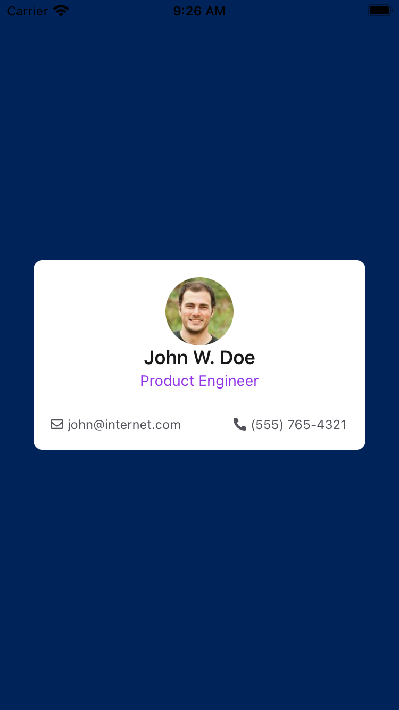
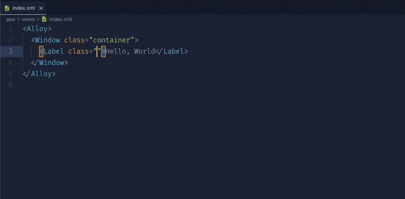

# Installation

Install PurgeTSS globally on your machine with [NPM](https://www.npmjs.com/).

```bash
> [sudo] npm install -g purgetss
```

:::caution Node.js 20+ required

PurgeTSS requires Node 20.0.0 or higher.

:::

## Run PurgeTSS the first time

:::info
Run `purgetss` once in your project to generate the required files and folders.

After that, every build parses your XML files and writes a clean `app.tss` with only the classes your project actually uses.
:::

When you run `purgetss` for the first time in a project, it does the following:


### 1. Auto-run hook

PurgeTSS adds a task in `alloy.jmk` so it runs every time you compile the app. It plays well with `liveview`.


### 2. purgetss folder

PurgeTSS creates a `purgetss` folder at the root of the project:

```bash title="./purgetss"
purgetss
└─ fonts
└─ styles
   └─ definitions.css
   └─ utilities.tss
└─ config.cjs
```

- `config.cjs` file

  This is where you customize defaults or add your own classes. For details, see the [customization section](customization/the-config-file).

- `styles` folder

  The `styles` folder contains the `utilities.tss` and `definitions.css` files:

  - `utilities.tss` file

    This file includes all utility classes, including any custom classes defined in `config.cjs`.

  - `definitions.css` file

    A CSS file that combines classes from `utilities.tss`, `_app.tss`, any `.tss` files in your project, and `fonts.tss`. The ["IntelliSense for CSS class names in HTML"](#vscode-extension) VS Code extension uses it for autocomplete.

- `fonts` folder

  Place icon, serif, sans-serif, or monospace font files here. See the [build-fonts command](commands#build-fonts-command) for instructions.

:::caution Important

PurgeTSS overwrites your existing `app.tss` file.

On the first run, your original `app.tss` is backed up to `_app.tss`.

From that point on, you add, delete, or update custom classes in `_app.tss`.

You can also move custom values into `config.cjs`. For details, see the [configuration section](customization/the-config-file).
:::

## Example files

To use the example files:
- Copy the content of `index.xml` and `app.tss` into a new Alloy project.
- Install Font Awesome font files with `purgetss icon-library --vendor=fontawesome`.
- Run `purgetss` once to generate the necessary files.
- Compile your app as usual.
- Use `liveview` for faster iteration.

```xml title=index.xml
<Alloy>
  <Window class="bg-primary">
    <View class="h-auto w-10/12 rounded-lg bg-white">
      <View class="vertical m-4">
        <ImageView class="rounded-16 mx-auto h-16 w-16" image="https://randomuser.me/api/portraits/men/43.jpg" />

        <View class="vertical">
          <Label class="text-center text-lg font-semibold text-gray-900">John W. Doe</Label>
          <Label class="mt-0.5 text-center text-sm text-purple-600">Product Engineer</Label>

          <View class="mt-6 w-screen">
            <View class="horizontal ml-0">
              <Label class="far fa-envelope mr-1 text-xs text-gray-600"></Label>
              <Label class="text-xs text-gray-600">john@internet.com</Label>
            </View>

            <View class="horizontal mr-0">
              <Label class="fas fa-phone-alt mr-1 text-xs text-gray-600"></Label>
              <Label class="text-xs text-gray-600">(555) 765-4321</Label>
            </View>
          </View>
        </View>
      </View>
    </View>
  </Window>
</Alloy>
```

```css title="app.tss"
'.bg-primary': {
  backgroundColor: '#002359'
}
```

:::info

After running `purgetss`, `app.tss` contains only the classes used in your XML files.

Your original `app.tss` is backed up as `_app.tss`. Use that file to add, delete, or update your custom styles.

Every time `purgetss` runs, it copies the content of `_app.tss` into `app.tss`.

:::

```css title="app.tss after purging"
/* PurgeTSS v7.2.7 */
/* Created by César Estrada */
/* https://github.com/macCesar/purgeTSS */

/* _app.tss styles */
'.bg-primary': {
  backgroundColor: '#002359'
}

/* Ti Elements */
'ImageView[platform=ios]': { hires: true }
'View': { width: Ti.UI.SIZE, height: Ti.UI.SIZE }
'Window': { backgroundColor: '#FFFFFF' }

/* Main Styles */
'.bg-white': { backgroundColor: '#ffffff' }
'.font-semibold': { font: { fontWeight: 'semibold' } }
'.h-16': { height: 64 }
'.h-auto': { height: Ti.UI.SIZE }
'.horizontal': { layout: 'horizontal' }
'.m-4': { top: 16, right: 16, bottom: 16, left: 16 }
'.ml-0': { left: 0 }
'.mr-0': { right: 0 }
'.mr-1': { right: 4 }
'.mt-0.5': { top: 2 }
'.mt-6': { top: 24 }
'.mx-auto': { right: null, left: null }
'.rounded-16': { borderRadius: 32 }
'.rounded-lg': { borderRadius: 8 }
'.text-center': { textAlign: Ti.UI.TEXT_ALIGNMENT_CENTER }
'.text-gray-600': { color: '#4b5563', textColor: '#4b5563' }
'.text-gray-900': { color: '#111827', textColor: '#111827' }
'.text-lg': { font: { fontSize: 18 } }
'.text-purple-600': { color: '#9333ea', textColor: '#9333ea' }
'.text-sm': { font: { fontSize: 14 } }
'.text-xs': { font: { fontSize: 12 } }
'.vertical': { layout: 'vertical' }
'.w-10/12': { width: '83.333334%' }
'.w-16': { width: 64 }
'.w-screen': { width: Ti.UI.FILL }

/* Default Font Awesome */
'.fa-envelope': { text: '\uf0e0', title: '\uf0e0' }
'.fa-phone-alt': { text: '\uf879', title: '\uf879' }
'.far': { font: { fontFamily: 'FontAwesome7Free-Regular' } }
'.fas': { font: { fontFamily: 'FontAwesome7Free-Solid' } }
```

<div align="center">

</div>

More examples in the [Utilities TSS Sample App](https://github.com/macCesar/utilities.tss-sample-app).

:::warning `Label`, `Button`, and `Switch` with opposite margins
In Titanium, `Label`, `Button`, and `Switch` can stretch when opposite margins pin both sides of the same axis and the dimension is still implicit.

- `mt-*` + `mb-*` or `my-*` can stretch the component vertically. Add `h-auto`.
- `ml-*` + `mr-*` or `mx-*` can stretch the component horizontally. Add `w-auto`.
- If margins affect both axes, use `wh-auto`.

This applies to any component whose default size is `Ti.UI.SIZE`. If you set opposite margins on the same axis, such as left and right, Titanium's composite layout uses those pins to calculate the dimension instead of the content. The component then stretches to fill its parent.

Examples:

```xml
<Label class="mt-2 mb-4 h-auto" text="Only content height" />
<Label class="mx-4 w-auto" text="Only content width" />
<Label class="m-4 wh-auto" text="Safe reset on both axes" />
<Switch class="my-1 mr-2 h-auto" onChange="onChanged" />
```
:::


## XML validation

Before purging, PurgeTSS pre-checks every XML file in your project. One case worth calling out: double dashes (`--`) are not allowed inside XML comments. That comes from the XML spec itself, not from PurgeTSS, but many people only run into it once a tool actually parses the file.

```xml
<!-- Options: --flag or --value -->
```

The `--flag` inside that comment is illegal. PurgeTSS stops with a pointer to the line:

```text
XML comment contains illegal "--" sequence ("--flag")
Fix: Replace "--" with an em dash or reword the comment to avoid double dashes
```

Either swap `--` for an em dash or rephrase so the two dashes don't sit next to each other. Any XML parser would reject the original, so catching it up front is more helpful than a confusing TSS output later.


## VSCode extension

If you're using [Visual Studio Code](https://code.visualstudio.com), install the [IntelliSense for CSS class names in HTML](https://marketplace.visualstudio.com/items?itemName=Zignd.html-css-class-completion) extension.

It provides class name completion for the `XML` class attribute based on the `definitions.css` file created by PurgeTSS.

<div align="center">

</div>

After installing the extension, add the `xml` language to the `"HTMLLanguages"` setting and exclude any `css/html` files from the caching process by pointing `"excludeGlobPattern"` to the `./purgetss/fonts/` folder.

```json title="VS Code settings.json file"
{
  "html-css-class-completion.HTMLLanguages": [
    "html",
    "vue",
    "razor",
    "blade",
    "handlebars",
    "twig",
    "django-html",
    "php",
    "markdown",
    "erb",
    "ejs",
    "svelte",
    "xml"
  ],
  "html-css-class-completion.excludeGlobPattern": "**/node_modules/**,purgetss/fonts/**/*.{css,html}"
}
```
