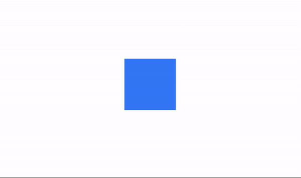
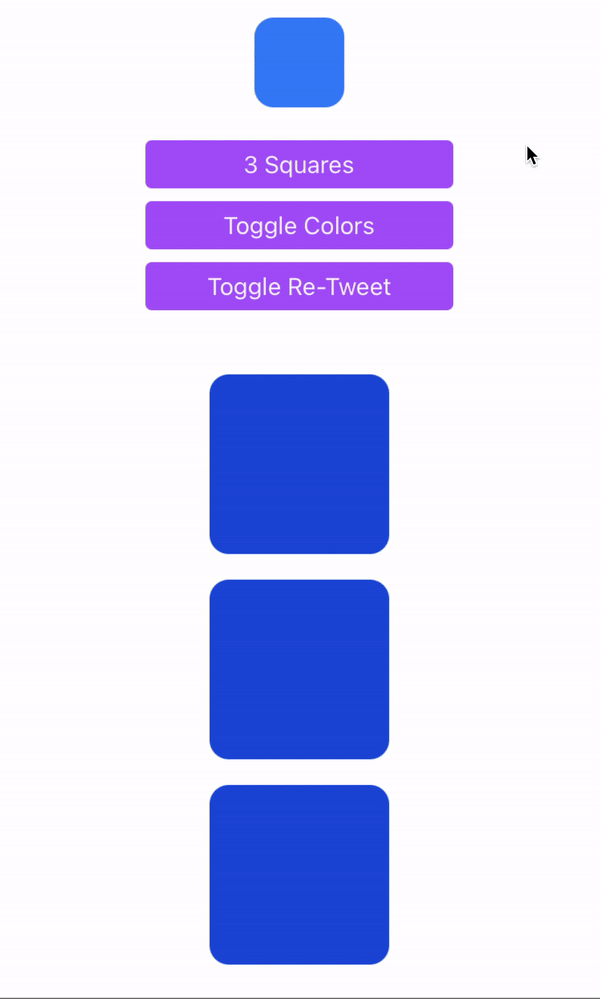
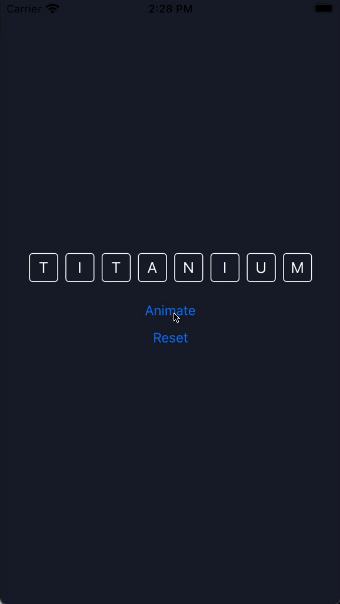

# The `play` Method

The `play` method runs the animation for a single view or an array of views. You can also chain multiple Animation objects with callbacks to build sequences.

```javascript
$.myAnimation.play($.myView)
```

### Play example 1
Create an Animation element and the view you want to animate, then set the properties.

```xml title="index.xml"
<Alloy>
  <Window>
    <Animation module="purgetss.ui" id="myAnimation" class="wh-32 bg-green-500 duration-1000" />

    <View id="square" class="wh-16 bg-blue-500" />
  </Window>
</Alloy>
```

In the controller, pass the element you want to animate. In this case, it is the `square` view.

```javascript title="index.js"
$.index.open()

$.myAnimation.play($.square)
```

When `play` runs, the blue square goes from 64x64 to 128x128 and changes to green.

<div align="center">

</div>

*Low framerate gif.*

### Real-world use case: Notification badge pulse

Use the `pulse` method for notification badges. The scale comes from the `<Animation />` object:

```xml title="badge-pulse.xml"
<Alloy>
  <Window class="bg-slate-900">
    <Animation id="pulseAnim" module="purgetss.ui" class="scale-(1.3) autoreverse duration-150" />

    <View class="wh-24">
      <View class="wh-20 clip-disabled rounded-xl bg-blue-500">
        <Label class="touch-enabled-false text-2xl text-white" text="@" />
      </View>

      <View id="badge" class="wh-6 rounded-full-6 right-1 top-1 bg-red-500">
        <Label class="touch-enabled-false text-center text-xs text-white" text="3" />
      </View>
    </View>
  </Window>
</Alloy>
```

```javascript title="badge-pulse.js"
function doPulse() {
  $.pulseAnim.pulse($.badge)
}

function doPulse3() {
  $.pulseAnim.pulse($.badge, 3)
}
```

One line per call. The badge scales to 130%, reverses back to 100%, repeated N times. The `scale` and `duration` are declared in the `<Animation />`, the `count` is the only parameter. See also [the `pulse` method](additional-methods#the-pulse-method) for details.

## `open` and `close` Modifiers

Use `open` and `close` to define different states, such as opening and closing behaviors.

### Play example 2

```xml title="index.xml"
<Alloy>
  <Window class="keep-screen-on">
    <Animation id="changeWidth" class="close:w-28 debug open:w-11/12" module="purgetss.ui" />
    <Animation id="changeColor" class="close:bg-blue-700 debug open:bg-purple-500" module="purgetss.ui" />
    <Animation id="changeTransparency" class="close:duration-300 open:mt-(null) close:mt-8 open:h-11/12 close:w-14 close:h-14 close:opacity-100 open:w-10/12 open:opacity-50 open:duration-150" module="purgetss.ui" />
    <Animation id="changeRetweet" class="close:duration-150 close:-mb-52 open:-mb-16 open:duration-200" module="purgetss.ui" />

    <View class="vertical">
      <Button class="ios:mt-16 mt-1 w-48 rounded bg-purple-500 text-purple-50" onClick="squaresFn" title="3 Squares" />
      <Button class="mt-2 w-48 rounded bg-purple-500 text-purple-50" onClick="toggleFn" title="Toggle Colors" />
      <Button class="mt-2 w-48 rounded bg-purple-500 text-purple-50" onClick="retweetFn" title="Toggle Re-Tweet" />

      <View id="squaresView" class="vertical mt-10 w-screen">
        <View class="wh-28 rounded-xl bg-blue-700" />
        <View class="wh-28 mt-4 rounded-xl bg-blue-700" />
        <View class="wh-28 mt-4 rounded-xl bg-blue-700" />
      </View>
    </View>

    <View id="blueSquareView" class="mt-8 h-14 w-14 rounded-xl bg-blue-500" onClick="transparencyFn" />

    <View id="retweetView" class="vertical -mb-52 h-48 w-screen rounded-2xl bg-gray-800" onClick="retweetFn">
      <View class="bg-slate-700 mt-4 h-1 w-8" />

      <View class="horizontal mx-4 mt-4">
        <Label class="text-slate-500 fas fa-retweet w-7 text-xl" />
        <Label class="ml-2 text-left text-xl text-white" text="Re-Tweet" />
      </View>

      <View class="horizontal mx-4 mt-4">
        <Label class="text-slate-500 fas fa-pencil-alt w-7 text-xl" />
        <Label class="ml-2 text-left text-xl text-white" text="Quote Tweet" />
      </View>
    </View>
  </Window>
</Alloy>
```

```javascript title="index.js"
function transparencyFn() {
  $.changeTransparency.play($.blueSquareView)
}

function toggleFn() {
  $.changeColor.toggle($.squaresView.children)
}

function squaresFn() {
  $.changeWidth.play($.squaresView.children)
}

function retweetFn() {
  $.changeRetweet.play($.retweetView)
}

$.index.open()
```

<div align="center">

</div>

*Low framerate gif.*

## `complete` modifier

Use `complete` to apply additional properties after an `open` animation finishes.

### Complete example 1

In this example, the `open` animation scales the children of the `letters` view down to 1%. When it completes, `complete` sets the background color to green and scales back to 100%.

```xml title="index.xml"
<Alloy>
  <Window title="App Wordle" class="bg-(#181e2d)">
    <Animation module="purgetss.ui" id="myAnimationReset" class="bg-transparent" />
    <Animation module="purgetss.ui" id="myAnimationOpen" class="open:scale-1 complete:bg-(#008800) complete:scale-100" />

    <View class="vertical">
      <View id="letters" class="horizontal">
        <Label class="wh-10 mx-1 rounded border-white bg-transparent text-center text-white" text="T" />
        <Label class="wh-10 mx-1 rounded border-white bg-transparent text-center text-white" text="I" />
        <Label class="wh-10 mx-1 rounded border-white bg-transparent text-center text-white" text="T" />
        <Label class="wh-10 mx-1 rounded border-white bg-transparent text-center text-white" text="A" />
        <Label class="wh-10 mx-1 rounded border-white bg-transparent text-center text-white" text="N" />
        <Label class="wh-10 mx-1 rounded border-white bg-transparent text-center text-white" text="I" />
        <Label class="wh-10 mx-1 rounded border-white bg-transparent text-center text-white" text="U" />
        <Label class="wh-10 mx-1 rounded border-white bg-transparent text-center text-white" text="M" />
      </View>

      <Button title="Animate" class="mt-8" android:onClick="doAnimate" ios:onSingletap="doAnimate" />
      <Button title="Reset" class="mt-4" android:onClick="doReset" ios:onSingletap="doReset" />
    </View>
  </Window>
</Alloy>
```

```javascript title="index.js"
$.index.open()

function doAnimate() {
  $.myAnimationOpen.play($.letters.children)
}

function doReset() {
  $.myAnimationReset.apply($.letters.children)
}
```

<div align="center">

</div>

## Callback event object

When you pass a callback to `play`, `toggle`, `open`, or `close`, it receives an enriched event object instead of the raw native event:

```javascript
$.myAnimation.play($.myView, (e) => {
  console.log(e.action)   // 'play'
  console.log(e.state)    // 'open' or 'close'
  console.log(e.id)       // Animation object ID
  console.log(e.targetId) // ID of the animated view
})
```

### Event object properties

| Property       | Type     | Description                                 |
| -------------- | -------- | ------------------------------------------- |
| `type`         | String   | Event type (`'complete'`)                   |
| `bubbles`      | Boolean  | Whether the event bubbles                   |
| `cancelBubble` | Boolean  | Whether bubbling is cancelled               |
| `action`       | String   | `'play'` or `'apply'`                       |
| `state`        | String   | `'open'` or `'close'`                       |
| `id`           | String   | ID of the Animation object                  |
| `targetId`     | String   | ID of the animated view                     |
| `index`        | Number   | Position of the view in the array (0-based) |
| `total`        | Number   | Total number of views in the array          |
| `getTarget()`  | Function | Returns the animated view object            |

### Animating an array of views

When you pass an array to `play`, the callback is called once per view. Use `index` and `total` to track progress:

```javascript
$.myAnimation.play([$.card1, $.card2, $.card3], (e) => {
  console.log(`Animated ${e.index + 1} of ${e.total}`)

  if (e.index === e.total - 1) {
    console.log('All animations complete')
  }
})
```

Use `getTarget()` to reference the specific view that just finished animating:

```javascript
$.myAnimation.play([$.card1, $.card2, $.card3], (e) => {
  const view = e.getTarget()
  view.borderColor = 'green'
})
```
