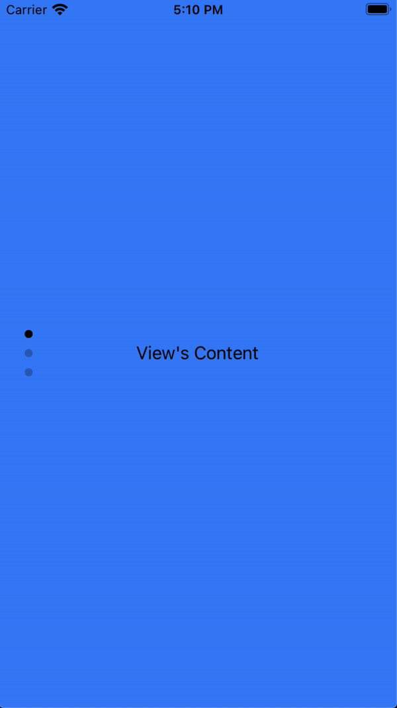

# The `apply` Method

Use `apply` when you want to set properties immediately without animation.

```javascript title="index.js"
$.myAnimation.apply($.myView)
```

### Apply example

`apply` sets properties instantly. In this example, the `ScrollableView` is rotated 90 degrees and its content is counter-rotated -90 degrees to mimic a **TikTok-style** layout.

```xml title="index.xml"
<Alloy>
  <Window class="exit-on-close-false keep-screen-on">
    <Animation module="purgetss.ui" id="rotate" class="platform-wh-inverted rotate-90" />
    <Animation module="purgetss.ui" id="counterRotate" class="platform-wh -rotate-90" />

    <ScrollableView id="scrollableView" class="overlay-enabled disable-bounce paging-control-alpha-100 scrolling-enabled show-paging-control paging-control-h-14 paging-control-on-top-false paging-control-transparent page-indicator-(rgba(0,0,0,0.24)) current-page-indicator-(rgba(0,0,0,1))">
      <View class="bg-blue-500">
        <Label class="text-center" text="View's Content" />
      </View>

      <View class="bg-red-500">
        <Label class="text-center" text="View's Content" />
      </View>

      <View class="bg-green-500">
        <Label class="text-center" text="View's Content" />
      </View>
    </ScrollableView>
  </Window>
</Alloy>
```

```javascript title="index.js"
$.rotate.apply($.scrollableView)

$.counterRotate.apply($.scrollableView.views)

$.index.open()
```

<div align="center">

</div>

*Low framerate gif.*

## Callback event object

`apply` also accepts an optional callback. It receives the same enriched event object as `play`, with `action` set to `'apply'` and `type` set to `'applied'`:

```javascript
$.myAnimation.apply($.myView, (e) => {
  console.log(e.action)   // 'apply'
  console.log(e.state)    // 'open' or 'close'
  console.log(e.targetId) // ID of the view
})
```

When passing an array of views, `index` and `total` work the same as with `play`. See [Callback event object](the-play-method#callback-event-object) for the full property reference.
