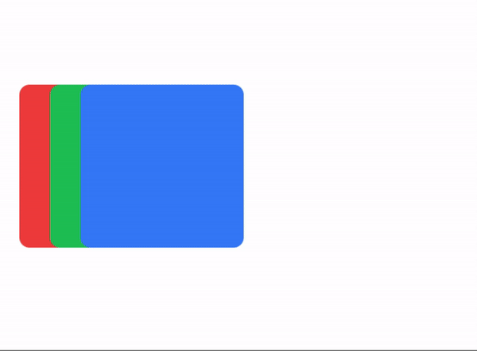
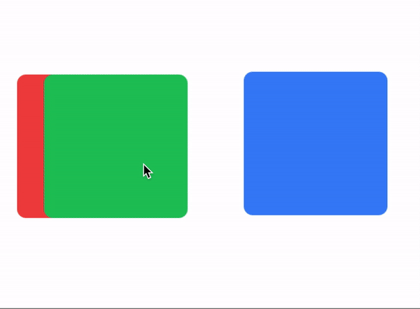
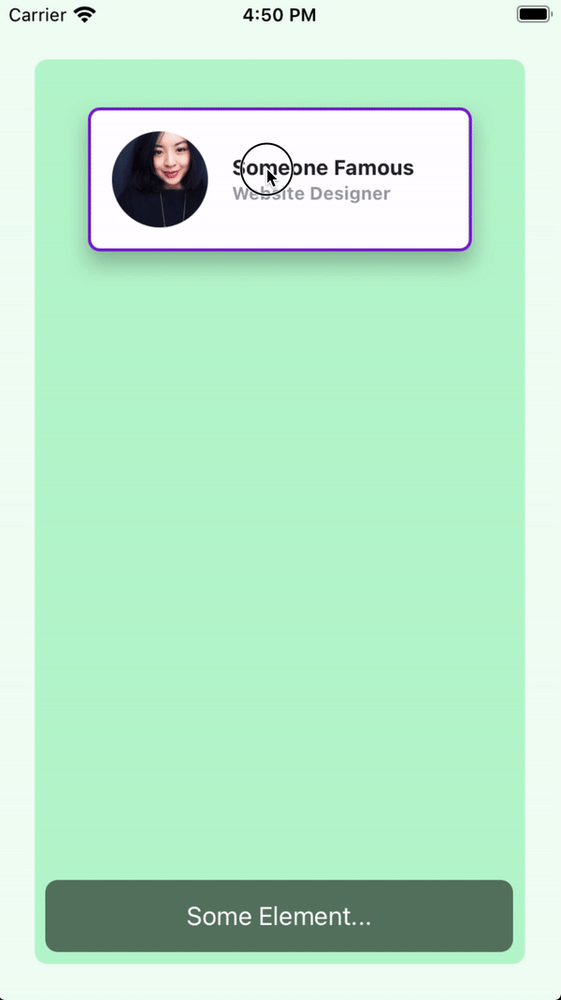
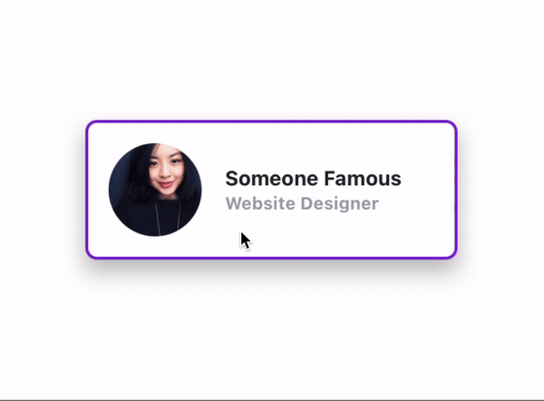

# The `draggable` Method

- The `draggable` method makes one or more views draggable.
- Use `drag:` and `drop:` modifiers for basic drag/drop animations.
- Use `drag-apply` or `drag-animate` to apply properties instantly or animate them while dragging.
- Use `horizontal-constraint` or `vertical-constraint` to constrain movement.

```javascript
// Calling a draggable method
$.draggableAnimation.draggable('A View or an array of Views')
```

:::info
You can create a blank Animation object or reuse an existing one to call `draggable` on a view or array of views.

When you use an Animation object with an array of views, it manages zIndex for each draggable element.
:::

### Draggable example
```xml title="index.xml"
<Alloy>
  <Window class="keep-screen-on exit-on-close-false">
    <Animation module="purgetss.ui" id="draggableAnimation" />

    <Label text="Draggable Example" class="mt-16 text-center" />

    <View id="red" class="ml-4 h-32 w-32 rounded-lg bg-red-500" />

    <View id="green" class="ml-10 h-32 w-32 rounded-lg bg-green-500" />

    <View id="blue" class="ml-16 h-32 w-32 rounded-lg bg-blue-500" />
  </Window>
</Alloy>
```

```javascript title="index.js"
$.index.open()

$.draggableAnimation.draggable([$.red, $.green, $.blue])
```

<div align="center">

</div>

*Low framerate gif.*

## `drag` and `drop` modifiers
- The `drag:` and `drop:` modifiers set basic animations while dragging and dropping.
- You can set global modifiers in the Animation object or set modifiers per view.
- Local modifiers override global modifiers.

:::info
To keep behavior predictable while dragging, we restrict the types of animations you can apply.

In particular, we do not apply `size`, `scale`, or `anchorPoint` transformations.
:::

### Drag and Drop example
```xml title="index.xml"
<Alloy>
  <Window class="keep-screen-on exit-on-close-false">
    <!-- Global set of modifiers -->
    <Animation id="draggableAnimation" module="purgetss.ui" class="drag:duration-100 drag:opacity-50 drop:opacity-100" />

    <Label text="Global Modifiers:\ndrag:duration-100 drag:opacity-50 drop:opacity-100" class="mt-16 text-center" />

    <!-- No local modifiers -->
    <Label id="red" class="mx-2 ml-4 h-32 w-32 rounded-lg bg-red-500 text-center text-xs text-white" text="No local modifiers" />

    <!-- drag:bg-green-800 drop:bg-green-500 -->
    <Label id="green" class="drag:bg-green-800 drop:bg-green-500 ml-10 h-32 w-32 rounded-lg bg-green-500 text-center text-xs text-white" text="drag:bg-green-800 drop:bg-green-500" />

    <!-- drag:opacity-25 -->
    <Label id="blue" class="drag:opacity-25 ml-16 h-32 w-32 rounded-lg bg-blue-500 text-center text-xs text-white" text="drag:opacity-25" />
  </Window>
</Alloy>
```

<div align="center">

</div>

*Low framerate gif.*

## `draggingType` Property
Use `drag-animate` (default) or `drag-apply` to control how `drag:` and `drop:` modifiers are applied. `drag-animate` animates the properties, `drag-apply` applies them immediately.

```css title="utilities.tss"
/* Component(s): For the Animation Component */
/* Property(ies): draggingType */
.drag-apply { draggingType: 'apply' }
.drag-animate { draggingType: 'animate' }
```

### Dragging Type example
In this example, the `Animation` object sets the global dragging type to `drag-apply`, but the green square overrides it to `drag-animate`.

```xml title="index.xml"
<Alloy>
  <Window class="keep-screen-on exit-on-close-false">
    <!-- Global set of modifiers -->
    <Animation id="draggableAnimation" module="purgetss.ui" class="drag-apply drag:duration-500 drag:opacity-50 drop:opacity-100" />

    <Label text="draggingType Example:\ndrag-apply drag:duration-500 drag:opacity-50 drop:opacity-100" class="mt-16 text-center" />

    <!-- No local modifiers, will be using the global modifiers -->
    <Label id="red" class="ml-4 h-32 w-32 rounded-lg bg-red-500 text-center text-xs text-white" text="No local modifiers" />

    <!-- drag-animate drag:bg-green-800 drop:bg-green-500 -->
    <Label id="green" class="drag-animate drag:bg-green-800 drop:bg-green-500 ml-10 h-32 w-32 rounded-lg bg-green-500 text-center text-xs text-white" text="drag-animate drag:bg-green-800 drop:bg-green-500" />

    <!-- drag:opacity-25 -->
    <Label id="blue" class="drag:opacity-25 ml-16 h-32 w-32 rounded-lg bg-blue-500 text-center text-xs text-white" text="drag:opacity-25" />
  </Window>
</Alloy>
```

<div align="center">

</div>

*Low framerate gif.*

## `bounds` modifier
- Use `bounds` with `horizontal-constraint` or `vertical-constraint` to limit movement within a parent view.
- You can set global boundaries in the `Animation` object or local boundaries per view.
- Local values override global values.

### Bounds example 1
The `card` view has a boundary of `m-4` and a bottom boundary of `mb-16`.

```xml title="index.xml"
<Alloy>
  <Window class="keep-screen-on exit-on-close-false bg-green-50">
    <Animation id="draggableAnimation" module="purgetss.ui" />

    <View class="mx-6 mb-6 mt-10 h-screen w-screen rounded-lg bg-green-200">
      <View id="card" class="bounds:m-2 bounds:mb-16 mt-8 h-24 w-64 shadow-lg">
        <View id="cardInside" class="w-screen rounded-lg border-2 border-purple-700 bg-white">
          <ImageView id="theImage" class="rounded-16 prevent-default-image m-4 ml-4 h-16 w-16 bg-gray-50" image="https://randomuser.me/api/portraits/women/17.jpg" />

          <View class="vertical ml-24 w-screen">
            <Label class="ml-0 text-sm font-bold text-gray-800" text="Ms. Jane Doe" />
            <Label class="ml-0 text-xs font-bold text-gray-400" text="Website Designer" />
          </View>
        </View>
      </View>

      <Label class="bg-(#80000000) mx-2 mb-2 h-12 w-screen rounded-lg text-center text-white" text="Some Element..." />
    </View>
  </Window>
</Alloy>
```

```javascript title="index.js"
$.index.open()

$.draggableAnimation.draggable($.card)
```

<div align="center">

</div>

*Low framerate gif.*

### Bounds example 2
Here the boundaries are set globally in `draggableAnimation`, so every card uses the same values.

```xml title="index.xml"
<Alloy>
  <Window class="keep-screen-on exit-on-close-false bg-green-50">
    <Animation id="draggableAnimation" module="purgetss.ui" class="bounds:m-2 bounds:mb-16" />

    <View class="wh-screen mx-6 mb-6 mt-10 rounded-lg bg-green-200">
      <View id="card" class="mt-8 h-24 w-64 shadow-lg">
        <View id="cardInside" class="w-screen rounded-lg border-2 border-purple-700 bg-white">
          <ImageView id="theImage" class="rounded-16 prevent-default-image wh-16 m-4 bg-gray-50" image="https://randomuser.me/api/portraits/women/17.jpg" />

          <View class="vertical ml-24 w-screen">
            <Label class="ml-0 text-sm font-bold text-gray-800" text="Ms. Jane Doe" />
            <Label class="ml-0 text-xs font-bold text-gray-400" text="Website Designer" />
          </View>
        </View>
      </View>

      <View id="card2" class="mt-40 h-24 w-64 shadow-lg">
        <View id="cardInside" class="w-screen rounded-lg border-2 border-purple-700 bg-white">
          <ImageView id="theImage" class="rounded-16 prevent-default-image wh-16 m-4 bg-gray-50" image="https://randomuser.me/api/portraits/women/21.jpg" />

          <View class="vertical ml-24 w-screen">
            <Label class="ml-0 text-sm font-bold text-gray-800" text="Ms. Jane Doe" />
            <Label class="ml-0 text-xs font-bold text-gray-400" text="Website Designer" />
          </View>
        </View>
      </View>

      <View id="card3" class="mt-72 h-24 w-64 shadow-lg">
        <View id="cardInside" class="w-screen rounded-lg border-2 border-purple-700 bg-white">
          <ImageView id="theImage" class="rounded-16 prevent-default-image wh-16 m-4 bg-gray-50" image="https://randomuser.me/api/portraits/women/25.jpg" />

          <View class="vertical ml-24 w-screen">
            <Label class="ml-0 text-sm font-bold text-gray-800" text="Ms. Jane Doe" />
            <Label class="ml-0 text-xs font-bold text-gray-400" text="Website Designer" />
          </View>
        </View>
      </View>

      <Label class="bg-(#80000000) mx-2 mb-2 h-12 w-screen rounded-lg text-center text-white" text="Some Element..." />
    </View>
  </Window>
</Alloy>
```

```javascript title="index.js"
$.index.open()

$.draggableAnimation.draggable([$.card, $.card2, $.card3])
```

<div align="center">

</div>

*Low framerate gif.*

## `vertical` and `horizontal` Constraints
Add `vertical-constraint` or `horizontal-constraint` to restrict movement while dragging.

```css
/* Component(s): Ti.UI.Animation */
/* Property(ies): A custom property to use it with the Animation module */
'.horizontal-constraint': { constraint: 'horizontal' }
'.vertical-constraint': { constraint: 'vertical' }
```

### Constraint example
In this example, the `card` view moves only side to side.

```xml title="index.xml"
<Alloy>
  <Window class="keep-screen-on exit-on-close-false">
    <Animation id="draggableAnimation" module="purgetss.ui" />

    <View id="card" class="horizontal-constraint h-24 w-64 shadow-lg">
      <View id="cardInside" class="w-screen rounded-lg border-2 border-purple-700 bg-white">
        <ImageView id="theImage" class="rounded-16 wh-16 m-4 ml-4" image="https://randomuser.me/api/portraits/women/17.jpg" />

        <View class="vertical ml-24 w-screen">
          <Label class="ml-0 text-sm font-bold text-gray-800" text="Ms. Jane Doe" />
          <Label class="ml-0 text-xs font-bold text-gray-400" text="Website Designer" />
        </View>
      </View>
    </View>
  </Window>
</Alloy>
```

```javascript title="index.js"
$.index.open()

$.draggableAnimation.draggable($.card)
```

<div align="center">

</div>

*Low framerate gif.*

## The `undraggable` method

Use `undraggable` to remove drag behavior and clean up all event listeners from one or more views.

```javascript
$.draggableAnimation.undraggable($.card)

// or with an array of views
$.draggableAnimation.undraggable([$.card1, $.card2, $.card3])
```

This method:
- Removes `touchstart`, `touchend`, and `touchmove` listeners from each view
- Removes the `orientationchange` listener from `Ti.Gesture`
- Removes the views from the collision detection registry
- Cleans up internal tracking properties (`_originTop`, `_originLeft`, `_visualTop`, `_visualLeft`, `_collisionEnabled`, `_dragListeners`)

### Real-world use cases

**Lock a piece after correct placement (puzzle game):**

```javascript
// When the piece lands on the correct slot
if (source.valor === target.valor) {
  $.anim.undraggable(source)  // Can't move it anymore
  source.applyProperties({ opacity: 0.6 })
}
```

**Toggle between edit and presentation mode:**

```javascript
function enterEditMode() {
  $.anim.draggable(views)
}

function enterPresentationMode() {
  $.anim.undraggable(views)
  $.anim.transition(views, showcaseLayout)
}
```

**Clean up when closing a Window (prevent memory leaks):**

```javascript
function onClose() {
  $.anim.undraggable(allDraggableViews)
}
```

This is especially important for the `Ti.Gesture.orientationchange` listener, which is global and does not get cleaned up automatically when the Window closes.

## The `detectCollisions` method

After calling `draggable()`, you can enable collision detection to know when a dragged view hovers over or is dropped onto another view.

```javascript
$.draggableAnimation.draggable(views)
$.draggableAnimation.detectCollisions(views, onHover, onDrop)
```

### Parameters

| Parameter | Type       | Description                                                    |
| --------- | ---------- | -------------------------------------------------------------- |
| `views`   | View/Array | The view or array of views to register for collision detection |
| `dragCB`  | Function   | Called during drag when the source hovers over a target        |
| `dropCB`  | Function   | Called on drop when a collision target is found                |

### How collision detection works

Collision is based on **center-point hit testing**: the center of the dragged view is checked against the `rect` bounds of each registered view.

**`dragCB(source, target)`** is called during drag:
- `target` is the view under the drag center, or `null` when leaving all targets
- Use this to show visual feedback (highlights, borders, scaling)

**`dropCB(source, target)`** is called on drop:
- `target` is the view where the source was released
- Snap behavior on drop depends on the classes applied to the `<Animation>` object (see below)

### Snap classes

Both snap behaviors are **off by default** — opt-in via classes on the `<Animation>` object:

| Class         | TSS Rule                                          | Behavior                                                                          |
| ------------- | ------------------------------------------------- | --------------------------------------------------------------------------------- |
| `snap-back`   | `animationProperties: { snap: { back: true } }`   | View returns to its origin position when dropped **outside** any collision target |
| `snap-center` | `animationProperties: { snap: { center: true } }` | View auto-centers on the target when dropped **on** it (uses `snapTo` internally) |

You can use both together:

```xml
<!-- Snap back when missing + center on target -->
<Animation id="myAnim" module="purgetss.ui" class="snap-back snap-center duration-200" />
```

**Without `snap-back`**: the view stays wherever you drop it, even if no target was hit.

**Without `snap-center`**: the view stays at the exact drop position on the target (no centering).

### Collision detection example

```xml title="index.xml"
<Alloy>
  <Window class="keep-screen-on">
    <Animation id="myAnimation" module="purgetss.ui" class="snap-back snap-center duration-200" />

    <View id="dropZone" class="wh-32 mt-8 rounded-lg border-2 border-dashed border-gray-400 bg-gray-100" />

    <View id="card" class="wh-24 mt-48 rounded-lg bg-blue-500" />
  </Window>
</Alloy>
```

```javascript title="index.js"
$.index.open()

const views = [$.dropZone, $.card]

$.myAnimation.draggable(views)

$.myAnimation.detectCollisions(views,
  // dragCB: visual feedback while hovering
  (source, target) => {
    if (target) {
      target.borderColor = 'green'
      target.backgroundColor = '#dcfce7'
    } else {
      // Reset all potential targets
      $.dropZone.borderColor = '#9ca3af'
      $.dropZone.backgroundColor = '#f3f4f6'
    }
  },
  // dropCB: handle the drop
  (source, target) => {
    console.log(`Dropped ${source.id} onto ${target.id}`)
    // Reset visual feedback
    target.borderColor = '#9ca3af'
    target.backgroundColor = '#f3f4f6'
  }
)
```

### Real-world use case: Drag-to-swap grid

A 3x3 grid where dragging a card onto another swaps their positions — combining `draggable`, `detectCollisions`, and `swap`:

```xml title="grid.xml"
<Alloy>
  <Window class="bg-slate-900" onClose="onClose">
    <Animation id="gridAnim" module="purgetss.ui" class="snap-back duration-150" />

    <!-- 3x3 Grid: 80px boxes (wh-20), 88px spacing -->
    <View class="clip-disabled">
      <!-- Row 0 -->
      <View id="c0" class="wh-20 left-0 top-0 rounded-xl bg-red-500 shadow-lg">
        <Label class="touch-enabled-false text-sm font-bold text-white" text="1" />
      </View>
      <View id="c1" class="wh-20 left-(88) top-0 rounded-xl bg-blue-500 shadow-lg">
        <Label class="touch-enabled-false text-sm font-bold text-white" text="2" />
      </View>
      <View id="c2" class="wh-20 left-(176) top-0 rounded-xl bg-green-500 shadow-lg">
        <Label class="touch-enabled-false text-sm font-bold text-white" text="3" />
      </View>

      <!-- Row 1 -->
      <View id="c3" class="wh-20 left-0 top-(88) rounded-xl bg-amber-500 shadow-lg">
        <Label class="touch-enabled-false text-sm font-bold text-white" text="4" />
      </View>
      <!-- ...c4 through c8 follow the same pattern -->
    </View>
  </Window>
</Alloy>
```

```javascript title="grid.js"
const cards = [$.c0, $.c1, $.c2, $.c3, $.c4, $.c5, $.c6, $.c7, $.c8]

// 1. Make all cards draggable
$.gridAnim.draggable(cards)

// 2. Enable collision + swap on drop
let lastTarget = null

$.gridAnim.detectCollisions(cards,
  function (source, target) {
    // Reset previous highlight
    if (lastTarget && lastTarget !== target) {
      lastTarget.applyProperties({ opacity: 1 })
    }
    if (target) {
      target.applyProperties({ opacity: 0.6 })
    }
    lastTarget = target
  },
  function (source, target) {
    if (target) {
      target.applyProperties({ opacity: 1 })
      $.gridAnim.swap(source, target)
    }
    lastTarget = null
  }
)

// 3. Clean up on close
function onClose() {
  $.gridAnim.undraggable(cards)
}
```

Three method calls set up a fully interactive grid with drag, collision detection, and animated swaps. The `lastTarget` tracking ensures only the current hover target is highlighted, and the `if (target)` guard prevents errors when dropping outside any card.
