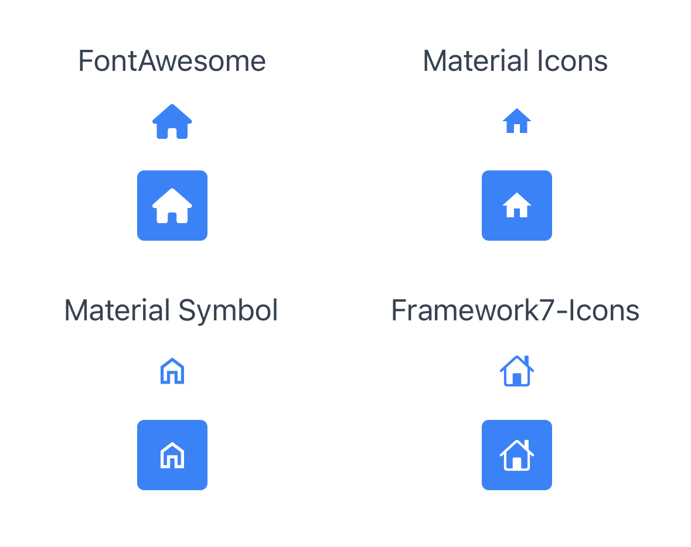

# Icon font libraries

PurgeTSS ships with four official icon font families, each preconfigured with the TSS classes and `fontFamily` mappings you need to drop icons into Buttons, Labels, and TextFields.

:::info Official icon fonts for PurgeTSS
- [Font Awesome 7 Free](https://fontawesome.com) (upgrade with `purgetss il -v=fa`)
- [Framework 7 Icons](https://framework7.io/icons/)
- [Material Icons](https://fonts.google.com/icons?icon.set=Material+Icons)
- [Material Symbols](https://fonts.google.com/icons?icon.set=Material+Symbols)

Older versions of PurgeTSS bundled additional libraries (Bootstrap Icons, Boxicons, LineIcons, Tabler Icons). They were removed to make maintenance easier, but you can [recreate them at the bottom of this page](#recreating-removed-icon-libraries).
:::

## Icon families reference

Each family ships one or more variant classes, each pointing to a specific font file. Combine a variant class with an icon class to render a glyph. For example, `msr ms-home` uses the Material Symbols Rounded font with the `home` icon.

| Family | Variant | Class | `fontFamily` |
|---|---|---|---|
| **Material Symbols** | Outlined (default) | `.ms` | `MaterialSymbolsOutlined-Regular` |
| Material Symbols | Outlined (alias) | `.mso` | `MaterialSymbolsOutlined-Regular` |
| Material Symbols | Rounded | `.msr` | `MaterialSymbolsRounded-Regular` |
| Material Symbols | Sharp | `.mss` | `MaterialSymbolsSharp-Regular` |
| **Font Awesome** | Solid (default) | `.fa` | `FontAwesome7Free-Solid` |
| Font Awesome | Solid (alias) | `.fas` | `FontAwesome7Free-Solid` |
| Font Awesome | Regular | `.far` | `FontAwesome7Free-Regular` |
| Font Awesome | Brands | `.fab` | `FontAwesome7Brands-Regular` |
| **Material Icons** | Regular | `.mi` | `MaterialIcons-Regular` |
| **Framework 7** | Regular | `.f7` | `Framework7-Icons` |

:::tip Icon class names
Across a family, the icon class is shared by every variant. For Material Symbols, there is one `ms-home` class; pair it with `.ms`, `.mso`, `.msr`, or `.mss` to pick the shape (outlined, rounded, or sharp). FontAwesome works the same way: `fa-home` pairs with `.fa`/`.fas` (Solid) or `.far` (Regular), while brand icons like `fa-github` need `.fab`. The variant class chooses the font file. The icon class chooses the glyph.
:::

### Full class lists

The complete class definitions live in the PurgeTSS `dist/` folder:

- [fontawesome.tss](https://github.com/macCesar/purgeTSS/blob/main/dist/fontawesome.tss)
- [materialicons.tss](https://github.com/macCesar/purgeTSS/blob/main/dist/materialicons.tss)
- [materialsymbols.tss](https://github.com/macCesar/purgeTSS/blob/main/dist/materialsymbols.tss)
- [framework7icons.tss](https://github.com/macCesar/purgeTSS/blob/main/dist/framework7icons.tss)

## Installing the icon fonts

Run [`icon-library`](../commands#icon-library-command) to copy the `.ttf` files into `./app/assets/fonts/`. That is the only step you need. Once the fonts are in place, the icon classes from the table above work out of the box.

```bash
# All four families
$ purgetss icon-library

# Selective install
$ purgetss il -v=fa,mi,ms,f7
```

:::info You do not need the `.tss` files in `./purgetss/styles/`
PurgeTSS already knows every official icon class and resolves them at compile time from its own bundled `dist/` files. You do not need `fontawesome.tss`, `materialsymbols.tss`, `materialicons.tss`, or `framework7icons.tss` inside `./purgetss/styles/` for `class="fas fa-home"` (or any other icon class) to work in your XML and controllers. Install the `.ttf` files with `icon-library` and the classes are ready.
:::

### Optional flags

Two optional flags adjust what `icon-library` copies into your project:

- `-s, --styles`: copies the official `.tss` source files into `./purgetss/styles/` for reference only. Useful if you want to grep the full class list, see how a class is defined, or override a specific class in your own project.
- `-m, --module`: copies the matching CommonJS module into `./app/lib/`, which exposes each icon's Unicode string to JavaScript. Handy when you set `label.text` from a controller and prefer a friendly name like `icons.fa.home` over a raw `\uf015`.

```bash
# Add either flag when you want them
$ purgetss il -s
$ purgetss il -m
$ purgetss il -m -s
```

## Using icons in XML

The variant class sets the `fontFamily`. The icon class sets the glyph (`text` / `title`). Apply both together:

```xml title="index.xml"
<Alloy>
  <Window>
    <View class="grid">
      <View class="vertical mx-auto grid-cols-2 gap-y-2">
        <!-- Material Symbols variants -->
        <Label class="mt-2 text-gray-700" text="Material Symbols" />
        <Button class="ms ms-home my-1 h-10 w-10 text-xl text-blue-500" />
        <Button class="msr ms-home my-1 h-10 w-10 text-xl text-blue-500" />
        <Button class="mss ms-home my-1 h-10 w-10 text-xl text-blue-500" />
      </View>

      <View class="vertical mx-auto grid-cols-2 gap-y-2">
        <!-- FontAwesome variants -->
        <Label class="mt-2 text-gray-700" text="Font Awesome" />
        <Button class="fas fa-home my-1 h-10 w-10 text-xl text-blue-500" />
        <Button class="far fa-bell my-1 h-10 w-10 text-xl text-blue-500" />
        <Button class="fab fa-github my-1 h-10 w-10 text-xl text-blue-500" />
      </View>
    </View>
  </Window>
</Alloy>
```

## Complete example with all four families

A side-by-side example using all four official families.

To use this file:

- Copy the content of `index.xml` into a new Alloy project.
- Install the official icon font files using `purgetss icon-library`.
  - Without `--vendor`, PurgeTSS copies all official icon fonts.
- Run `purgetss` once to generate the required files.
- Compile your app as usual.
- Use `liveview` if you want faster testing.

```xml title="index.xml"
<Alloy>
  <Window>
    <View class="grid">
      <View class="vertical mx-auto grid-cols-2 gap-y-2">
        <!-- FontAwesome -->
        <Label class="mt-2 text-gray-700" text="FontAwesome" />
        <Button class="fa fa-home my-1 h-10 w-10 text-xl text-blue-500" />
        <Button class="fa fa-home my-1 h-10 w-10 rounded bg-blue-500 text-xl text-white" />
      </View>

      <View class="vertical mx-auto grid-cols-2 gap-y-2">
        <!-- Material Icons -->
        <Label class="mt-2 text-gray-700" text="Material Icons" />
        <Button class="mi mi-home my-1 h-10 w-10 text-xl text-blue-500" />
        <Button class="mi mi-home my-1 h-10 w-10 rounded bg-blue-500 text-xl text-white" />
      </View>

      <View class="vertical mx-auto grid-cols-2 gap-y-2">
        <!-- Material Symbol -->
        <Label class="mt-2 text-gray-700" text="Material Symbol" />
        <Button class="ms ms-home my-1 h-10 w-10 text-xl text-blue-500" />
        <Button class="ms ms-home my-1 h-10 w-10 rounded bg-blue-500 text-xl text-white" />
      </View>

      <View class="vertical mx-auto grid-cols-2 gap-y-2">
        <!-- Framework7-Icons -->
        <Label class="mt-2 text-gray-700" text="Framework7-Icons" />
        <Button class="f7 f7-house my-1 h-10 w-10 text-xl text-blue-500" />
        <Button class="f7 f7-house my-1 h-10 w-10 rounded bg-blue-500 text-xl text-white" />
      </View>
    </View>
  </Window>
</Alloy>
```

```css title="app.tss"
// PurgeTSS v7.10.2
// Created by César Estrada
// https://purgetss.com

/* Ti Elements */
'View': { width: Ti.UI.SIZE, height: Ti.UI.SIZE }
'Window': { backgroundColor: '#FFFFFF' }

/* Main Styles */
'.bg-blue-500': { backgroundColor: '#3b82f6' }
'.gap-y-2': { top: 8, bottom: 8 }
'.grid': { layout: 'horizontal', width: '100%' }
'.grid-cols-2': { width: '50%' }
'.h-10': { height: 40 }
'.mt-2': { top: 8 }
'.mx-auto': { right: null, left: null }
'.my-1': { top: 4, bottom: 4 }
'.rounded': { borderRadius: 4 }
'.text-blue-500': { color: '#3b82f6', textColor: '#3b82f6' }
'.text-gray-700': { color: '#374151', textColor: '#374151' }
'.text-white': { color: '#ffffff', textColor: '#ffffff' }
'.text-xl': { font: { fontSize: 20 } }
'.vertical': { layout: 'vertical' }
'.w-10': { width: 40 }

/* Default Font Awesome */
'.fa': { font: { fontFamily: 'FontAwesome7Free-Solid' } }
'.fa-home': { text: '\uf015', title: '\uf015' }

/* Material Icons */
'.mi': { font: { fontFamily: 'MaterialIcons-Regular' } }
'.mi-home': { text: '\ue88a', title: '\ue88a' }

/* Material Symbols */
'.ms': { font: { fontFamily: 'MaterialSymbolsOutlined-Regular' } }
'.ms-home': { text: '\ue88a', title: '\ue88a' }

/* Framework7 */
'.f7': { font: { fontFamily: 'Framework7-Icons' } }
'.f7-house': { text: 'house', title: 'house' }
```

<div align="center">

</div>

## Customizing Font Awesome

If you have a [Font Awesome Pro account](https://fontawesome.com/pro) or want to try the Beta, PurgeTSS can generate a custom `./purgetss/styles/fontawesome.tss` with the Pro or Beta classes.

### Font Awesome Pro

After setting the [@fortawesome scope](https://fontawesome.com/how-to-use/on-the-web/setup/using-package-managers#installing-pro) with your token, install it in your project's root folder with `npm init` and `npm install --save-dev @fortawesome/fontawesome-pro` (current version 7.1.0).

To generate a new `purgetss/styles/fontawesome.tss`, run `purgetss build`. It also copies the Pro font files into `./app/assets/fonts` if needed.

Note: Titanium cannot use Font Awesome duotone icons because each icon uses two glyphs.

### Font Awesome 7 Beta

To generate a custom `fontawesome.tss` file from [Font Awesome 7 Beta](https://fontawesome.com/download):

Move the "css" and "webfonts" folders from "fontawesome-pro-7.0.0-beta3-web/":

```bash
fontawesome-pro-7.0.0-beta3-web
└─ css
└─ webfonts
```

Into `./purgetss/fontawesome-beta`:

```bash
purgetss
└─ fontawesome-beta
   ├─ css
   └─ webfonts
```

Then run `purgetss build` to generate your custom `fontawesome.tss` file and test the new icons.

## Recreating removed icon libraries

Older versions of PurgeTSS bundled Bootstrap Icons, Boxicons, LineIcons, and Tabler Icons. The list was trimmed to make maintenance easier, but you can rebuild any of them:

1. Download the library from its official site:
   - [Bootstrap Icons](https://icons.getbootstrap.com)
   - [Boxicons](https://boxicons.com)
   - [LineIcons](https://lineicons.com/icons/?type=free)
   - [Tabler Icons](https://tabler-icons.io)
2. Place the `.ttf`/`.otf` and `.css` files into `./purgetss/fonts/<library>/`.
3. Run `purgetss build-fonts`.

For the underlying mechanics (how `build-fonts` reads the `.css`, options like `-m` and `-f`), see [Custom fonts](custom-fonts).
