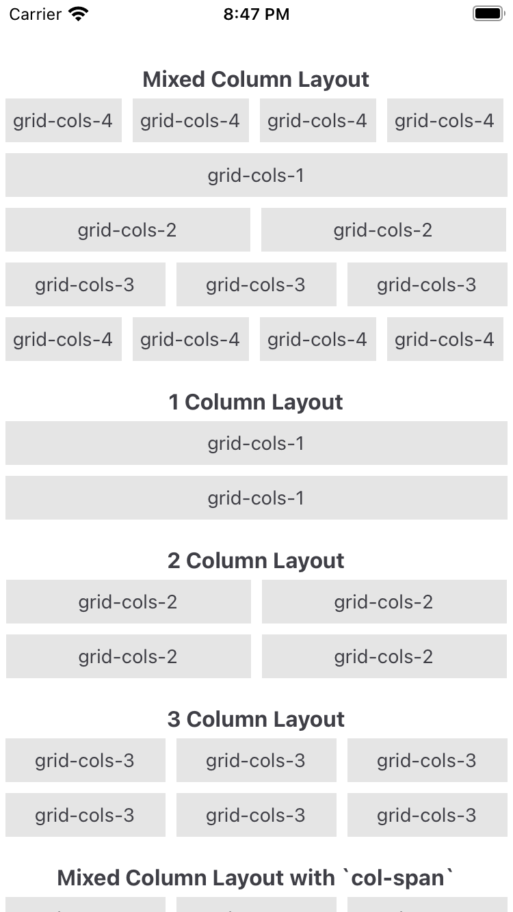

# Grid system

The grid system is a small layout tool that lets you build rows and columns with utility classes.

The snippet below shows the simplest layout. From there, you can mix columns and rows as needed.

```xml title="index.xml"
<Alloy>
  <View class='grid'>
    <View class="grid-cols-4">
      <!-- Remove it if you don't need a gutter between columns (or rows) -->
      <View class="gap-1">
        <!-- ANY CONTENT GOES HERE -->
      </View>
    </View>

    <View class="grid-cols-4">
      <!-- Remove it if you don't need a gutter between columns (or rows) -->
      <View class="gap-1">
        <!-- ANY CONTENT GOES HERE -->
      </View>
    </View>
    ...
    ...
    ...
  </View>
</Alloy>
```

## Column grid
`grid-cols-{n}`
Use `grid-cols` to set how many columns fit in each row. For example, `.grid-cols-2` fits two views per row, `.grid-cols-3` fits three, and so on.

`col-span-{n}`
Use `col-span` to set how many columns an element occupies in a 12-column grid.

If a view uses `.col-span-3`, you can add three more views of the same width to fill the row. Other combos like 3-6-3 or 2-4-6 work too, as long as the total is 12.

## Row grid
`grid-rows-{n}`
Use `grid-rows` to set how many rows fit in each column. For example, `.grid-rows-2` fits two views per column, `.grid-rows-3` fits three, and so on.

`row-span-{n}`
Use `row-span` to set how many rows an element occupies in a 12-row grid.

If a view uses `.row-span-3`, you can add three more views of the same height to fill the column. Other combos like 3-6-3 or 2-4-6 work too, as long as the total is 12.

<div align="center">

</div>

## Available utilities
These are the available utilities to control ["The Grid"](https://youtu.be/4-J4duzP8Ng?t=13).

### Gutter utilities
  - `gap-{size}`: Use this to change the gap between rows and columns.
  - `gap-x-{size}` and `gap-y-{size}`: Use these to change the gap between rows and columns independently.
  - `gap-{side}-{size}`: Use this to change the gap between rows and columns on a specific side (t=top, r=right, b=bottom, l=left).

### Column span utilities
  - Use `col-span-{n}` to make an element span n columns.

### Row span utilities
  - Use `row-span-{n}` to make an element span n rows.

### Direction utilities
  - `grid` or `grid-flow-col`: Use these utilities to set the layout property to horizontal.
  - `grid-flow-row`: Use this utility to set the `layout` property to `vertical`.

### Column utilities
  - `grid-cols-{n}`: Use this utility to create grids with n equally sized columns.

### Row utilities
  - Use `grid-rows-{n}` to create grids with n equally sized rows.

### Row placement utilities
  - `start`: Aligns an element to the start of a row.
  - `end`: Aligns an element to the end of a row.
  - `center`: Aligns an element to the center of a row.
